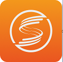

<!-- _coverpage.md -->

<small></small>

# HUAWEI LiteOS Studio

> 以`Visual Studio Code`的社区开源代码为基础，根据

> `LiteOS`嵌入式系统软件开发语言、业务场景等特点开发

>  的一款轻量级定制集成开发环境解决方案。

[使用文档](/README)
[工程示例](project_stm32.md)
[技术支持](https://gitee.com/LiteOS/LiteOS_Studio/issues)
[下载软件](https://gitee.com/LiteOS/LiteOS_Studio/releases/V1.45.1)

<!-- 背景色 -->

