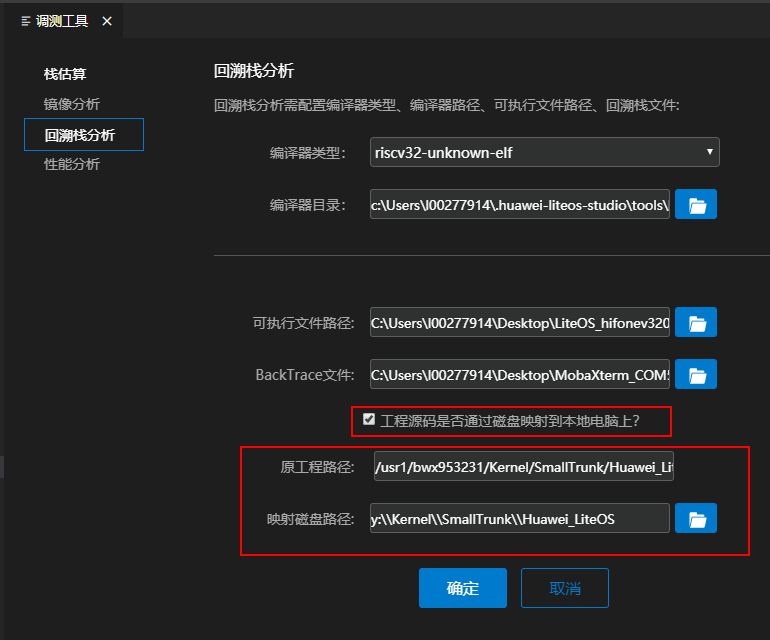
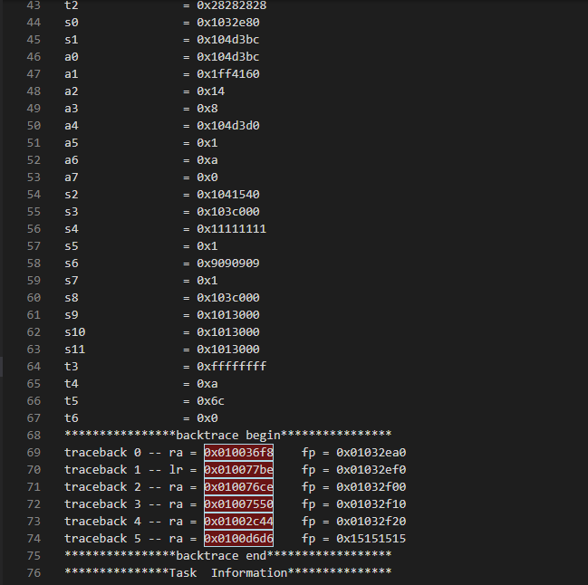
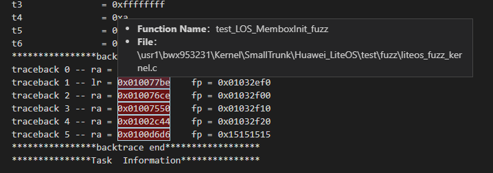
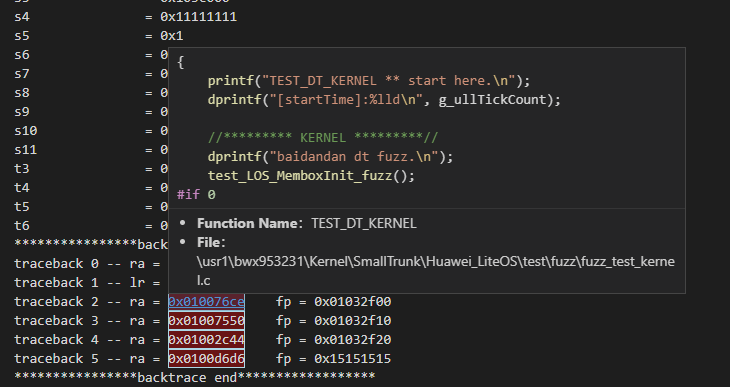

  <h1 align="center">回溯栈分析工具</h1>

LiteOS Studio可对输出的backtrace文件进行解析，自动标记回溯栈地址，支持快速解析出对应函数、文件路径，且支持文件跳转。

### 1、回溯栈分析页面入口
> 打开Liteos Studio工具，点击调测工具里的回溯栈分析tab页签，设置编译器、可执行文件路径等，选择backtrace文件（目前仅支持后缀为.backtrace的文件），然后点击确定进入回溯栈分析页面。

> 或者直接打开backtrace文件

### 2、回溯栈分析相关配置
回溯栈分析依赖工程的可执行文件（如elf文件、bin文件）、编译器类型、编译器路径，需在调测工具设置界面进行相关设置。
如果工程源码在linux上，可将工程映射到windows磁盘上，然后进行相关路径配置如下图所示。

### 3、回溯栈分析页面介绍
如果配置好回溯栈分析的相关依赖，打开backtrace文件，回溯栈地址会高亮显示，鼠标移动到地址上时会显示函数名称和文件路径，Ctrl+鼠标移动到地址上会显示函数详情且点击时可跳转到对应的代码行号。

