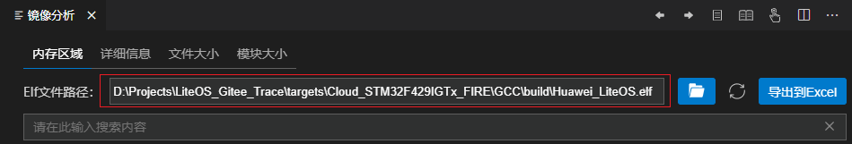
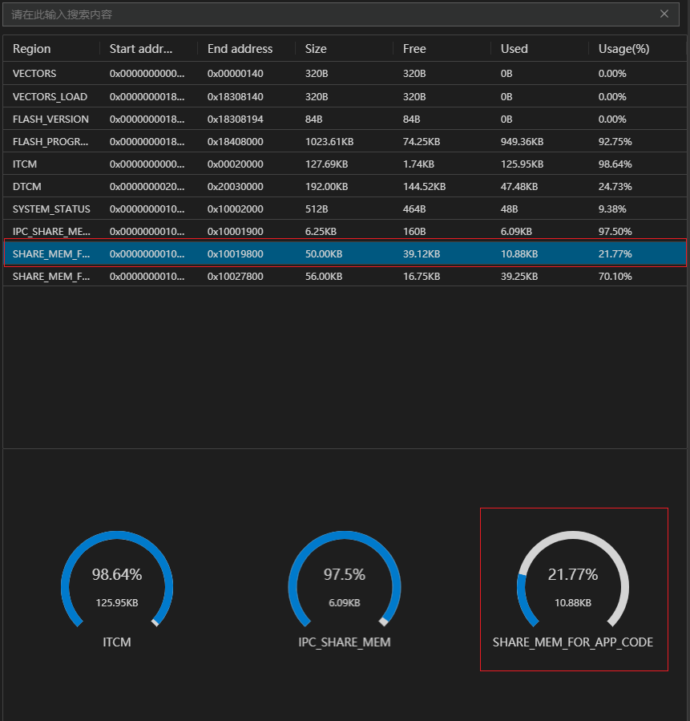
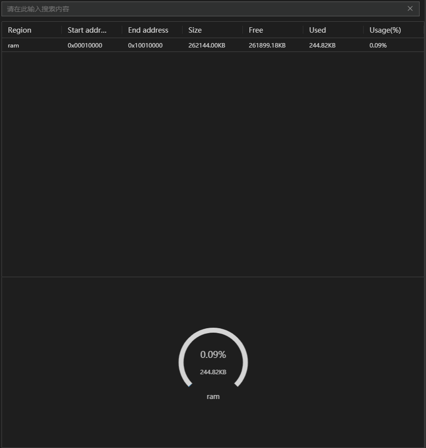
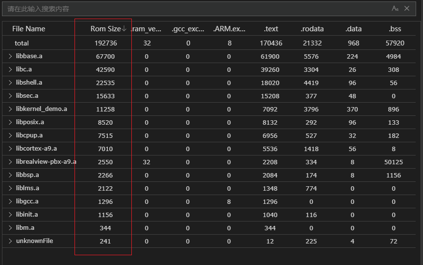
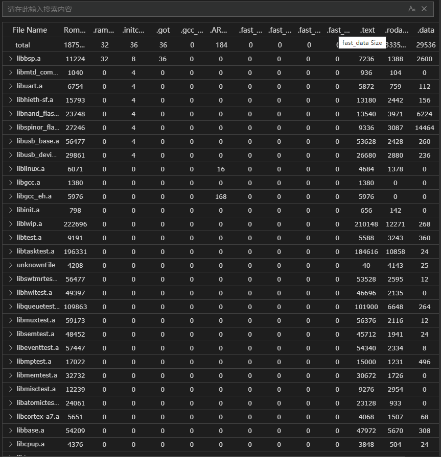
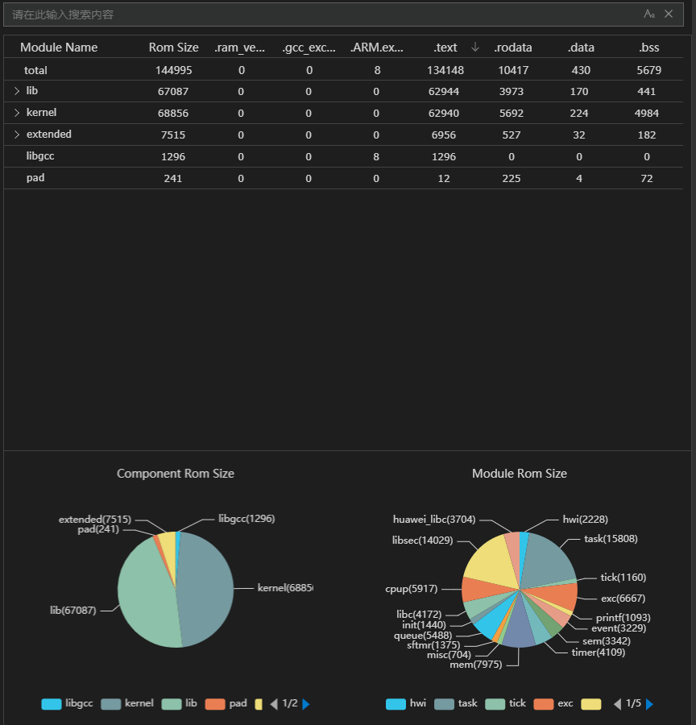
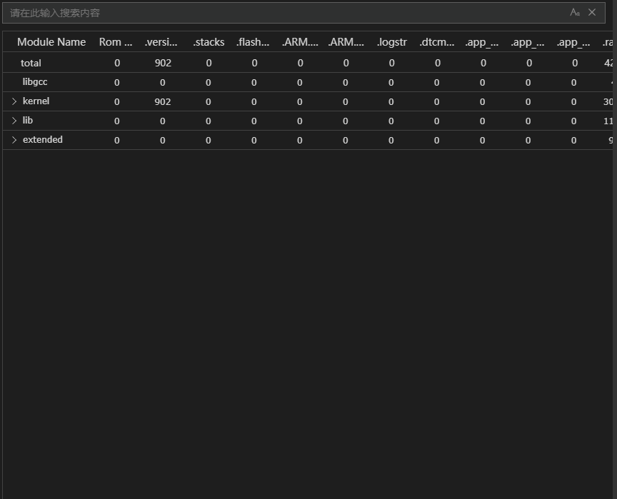

  <h1 align="center">镜像分析工具</h1>

LiteOS Studio对构建出的elf文件进行内存占用分析，支持LiteOS开发者快速评估内存段、符号表使用情况。

### 1、镜像分析页面入口
> 打开Liteos Studio工具，点击调测工具里的镜像分析tab页签，设置编译器、可执行文件路径等，然后点击确定进入镜像分析页面。

> 或者通过打开命令行输入`build`找到`Build Analyzer`点击进入。

### 2、镜像分析相关配置
镜像分析依赖工程的elf文件、map文件、编译器类型、编译器路径，需在调测工具设置界面进行相关设置。镜像分析结果展示界面可修改elf文件路径，配置好elf文件路径后，可点击右边的按钮重新执行镜像分析。

### 3、镜像分析页面介绍
镜像分析页面包括内存区域、详细信息、文件大小和模块大小。

#### 内存区域
内存区域包括每个内存区域数据的一个表格，包含了起始地址和结束地址以及内存占用。
表格下面默认显示内存占比最高的前三个区域内容。

点击不同的行会在下面仪表盘中显示点击行的数据。

#### 详细信息
详细信息里显示了Section和Symbol的信息。通过树表格展示层级关系，名称，VMA和LMA。双击Symbol子节点会跳转到具体的代码行号。

页面也支持搜索Name定位到具体的行，然后通过键盘Enter键跳转到下一个符合搜索条件的行，点击可以开启支持正则搜索。

同时，点击表头的每列会对该列数据进行排序。

#### 文件大小
文件大小里展示了文件和文件层级的大小以及总数，点击表头会对该列数据进行排序。

表格除了File Name和Rom Size以外其他的列，都是动态变化的。

#### 模块大小
模块大小里展示了文件和文件层级的大小以及总数，点击表头会对该列数据进行排序。

类似文件大小，模块大小表格除了File Name和Rom Size以外其他的列，也都是动态变化的。下面展示的饼图显示父节点和子节点的数据情况，如果不存在子节点，就只显示父节点的图；如果存在子节点，左侧图是父节点，右侧图是子节点。

