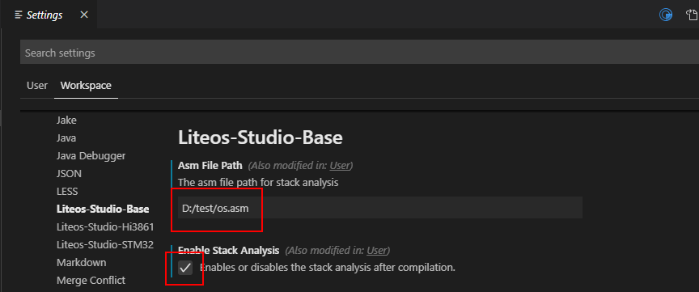
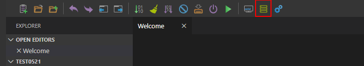
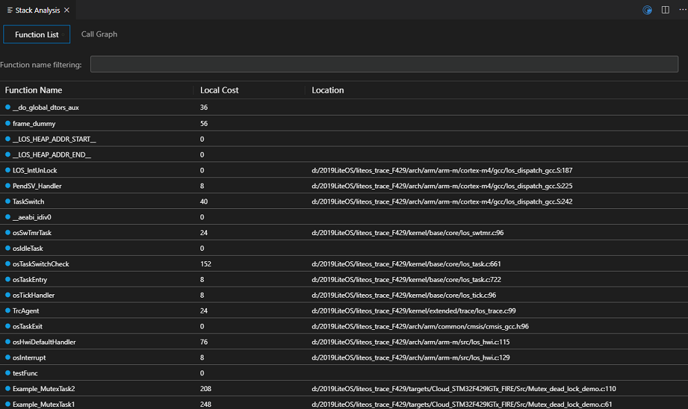
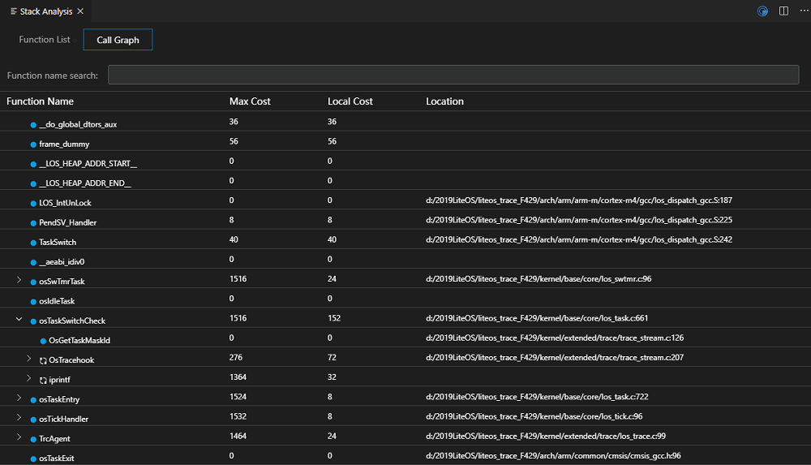

  <h1 align="center">调测工具</h1>

提供一定的调测能力，辅助用户定位或分析问题。当前提供的工具有：栈估算，使用模拟执行和动态标记技术来精确估算任务栈的内存使用空间；LMS功能，动态检测heap内存发生的读写溢出，释放后使用等非法操作问题；Trace功能，端侧实现轻量级LiteOS事件监测，用户可在任意时段开始和停止记录Trace，并且可以图形化展示事件、CPU、内存、运行轨迹等信息。

### 栈估算
1、设置界面打开栈估算开关、配置asm文件路径

2、如果工程目录还未生成asm文件，请先编译工程

3、工程编译完成或工程目录已存在asm文件，通过菜单栏点击栈估算按钮查看栈估算结果

4、栈估算结果按函数列表和调用关系展示

