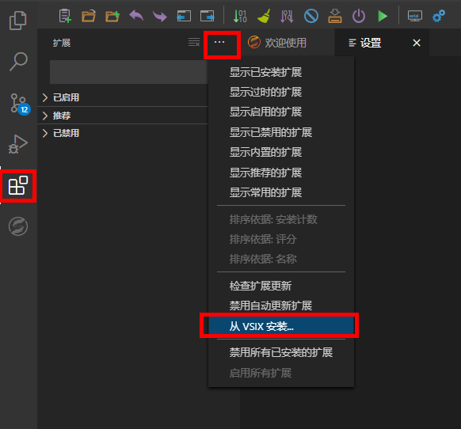
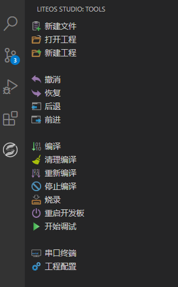

<!-- markdownlint-disable MD033 MD041-->

  <h1 align="center">HUAWEI LiteOS Studio扩展介绍</h1>

### 扩展发布说明

由于不同的开发板的编译、烧录、调测方式差异较大，`HUAWEI LiteOS Studio`通过不同的扩展来灵活支持各种目标开发板。`HUAWEI LiteOS Studio`扩展主要包含`LiteOS Studio Base基座扩展`和
为不同的开发板定制的扩展，如`STM32`开发板扩展、`WiFi IoT Hi3861`开发板扩展。为实现`GDB`图形化调测能力，还提供了`LiteOS Studio Debug`调测扩展。在`HUAWEI LiteOS Studio`集成开发环境中已经预置了基座扩展，调测扩展，和部分开发板扩展。如果用户使用VSCode、或其他基于VSCode的定制`IDE`，也可以通过安装`HUAWEI LiteOS Studio`扩展来实现`HUAWEI LiteOS Studio`相同的能力。

各个扩展的安装文件后缀为`.vsix`， 访问[LiteOS Studio Extensions](https://gitee.com/LiteOS/LiteOS_Studio/extensions)可以下载扩展安装文件。

#### 扩展安装

在IDE 活动栏中，打开`扩展`视图，点击更多操作`...`，在弹出的菜单中选择`从 VSIX 安装`，然后指定扩展文件的路径，即可完成安装扩展。

**注意：由于扩展中预置了适用于Windows平台的编译器、烧录、调测工具等，HUAWEI LiteOS Studio扩展仅能安装到 Windows 版本的基于VSCode的IDE。<bont>**

### LiteOS Studio Base扩展介绍

`HUAWEI LiteOS Studio Base`基座扩展， 可以安装到各种基于`VSCode`的IDE，如`VSCode-Huawei`、`WeCode`等。 基座扩展实现快捷极简的编译、烧录、调试、目标板选择等工程配置，增加了侧边栏工具按钮 ， 集成了`HUAWEI LiteOS Studio`中工具栏支持的功能，点击侧边栏工具按钮， 界面如下：

除了基座扩展，`HUAWEI LiteOS Studio`为不同需求的开发板用户提供了定制化的扩展。如下：

### LiteOS Studio STM32扩展

对于[开源LiteOS](https://gitee.com/LiteOS/LiteOS)用户，安装`HUAWEI LiteOS Studio Base`基座扩展和`LiteOS Studio STM32`开发板扩展后，可以利用`IDE`新建`LiteOS`工程， 支持对`STM32系列`开发板工程进行编译、烧录、调试等操作。`LiteOS Studio STM32`扩展集成支持`Gitee-LiteOS-Master`等`开源 LiteOS SDK` 版本，用户也可以自行配置支持的`SDK`版本， 支持`STM32F429IG`、`STM32F769NI`、`STM32L431RC`、`STM32F103ZE`等开发板。

### LiteOS Studio Hi3861扩展

对于`WIFI IoT Hi3861`开发板用户，安装`HUAWEI LiteOS Studio Base`基座扩展和`LiteOS Studio Hi3861`开发板扩展后，可以利用`IDE`新建`WIFI IoT Hi3861`工程， 支持对`WIFI IoT Hi3861`开发板工程进行编译、烧录、调试、组件配置等操作。

**注意：仅`WIFI IoT Hi3861`开发板支持组件化配置<bont>**

### LiteOS Studio Debug调测扩展

`LiteOS Studio Debug`调测扩展支持对`HUAWEI LiteOS Studio`工程进行`GDB`图形化调测，支持`Jlink`、`OpenOCD`等调测器。该扩展还集成多线程感知等能力，调测时在调用栈视图中支持同时展示多个任务的调用栈信息。

在`HUAWEI LiteOS Studio`中已经预置，使用VSCode等IDE的用户需要自己安装该扩展。