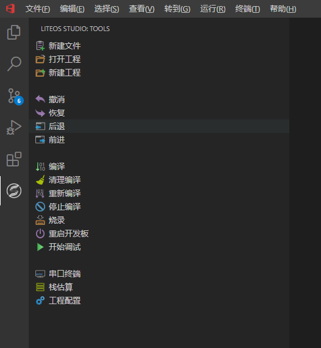
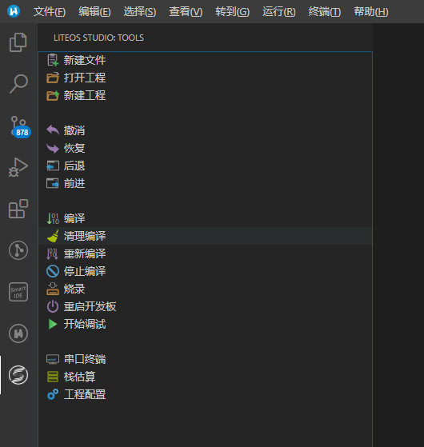

  <h1 align="center">HUAWEI LiteOS Studio扩展介绍</h1>

下图为`VSCode-Huawei`与`WeCode`使用`HUAWEI LiteOS Studio`扩展演示：

 

### LiteOS Studio Base扩展介绍
`HUAWEI LiteOS Studio Base`扩展为`HUAWEI LiteOS Studio`的基座扩展, 目前支持`VSCode-Huawei`、`WeCode`等常用IDE进行安装, 基座扩展支持各种开发板工程, 支持

快捷极简的编译、烧录、调试、目标板等工程配置。基座扩展增加了侧边栏工具按钮 , 集成了`HUAWEI LiteOS Studio`中工具栏支持的

功能,点击侧边栏工具按钮, 界面如下：

除了基座扩展,`HUAWEI LiteOS Studio`为不同需求的开发板用户提供了定制化的扩展。

### LiteOS Studio Hi3861扩展

针对使用`WIFI IoT`开发板用户, 用户仅在安装了基座扩展和`LiteOS Studio Hi3861`扩展后, 才能够在IDE上对`WIFI IoT`开发板进行编译、烧录、调试、组件配置等操作。

### LiteOS Studio STM32扩展

针对使用开源版本下支持的开发板用户,支持`LiteOSV200R001C50B038`、`LiteOSV200R001C50B039`和`Gitee-LiteOS-Master`版本, 支持`STMF429、STMF769、STML431`开发

板, 用户仅在安装了基座扩展和`LiteOS Studio STM32扩展后,才能够才能够在IDE上对`STM系列`开发板进行编译、烧录、调试等操作。

注意：目前,仅`WIFI IoT`开发板支持组件化配置, 仅在`HUAWEI LiteOS Studio`IDE中支持新建工程功能, 其他IDE通过安装扩展暂时无法下载开发板SDK

### Cortex-Debug扩展

`HUAWEI LiteOS Studio`已经预置，支持`Jlink`、`OpenOCD`、`St-Link`等调测方式的扩展。