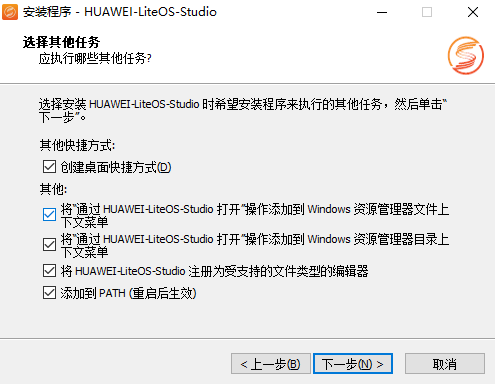
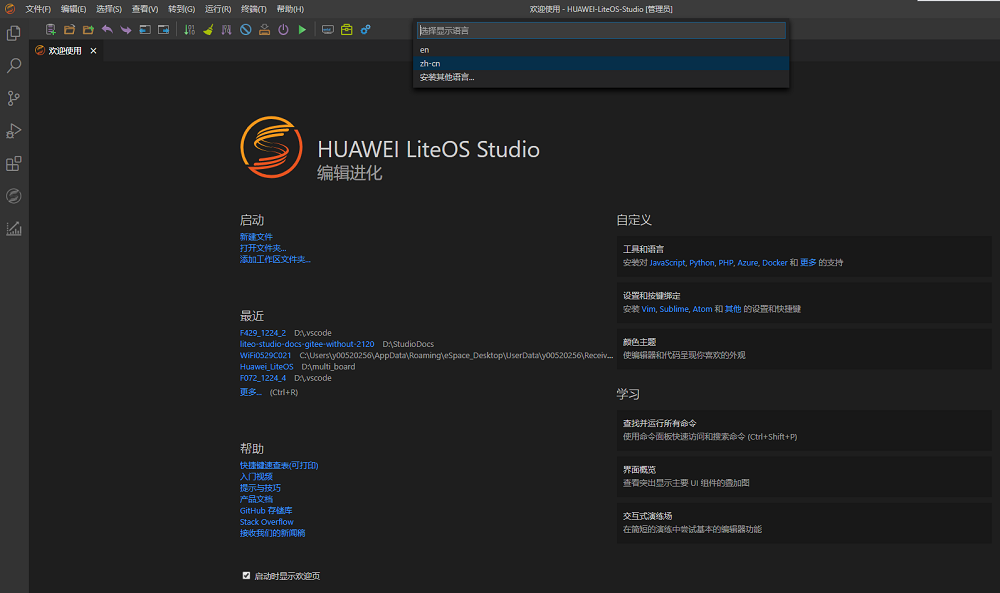

<!-- markdownlint-disable MD033 MD041-->

  <h1 align="center">HUAWEI LiteOS Studio安装</h1>

`HUAWEI LiteOS Studio`当前只提供Windows 10 64 位操作系统上的安装版本，如果对其他系统上有诉求，请联系我们。

### 获取安装文件

获取`HUAWEI LiteOS Studio`安装包<a href="https://gitee.com/LiteOS/LiteOS_Studio/releases/V1.45.1" target="_blank">`HUAWEI-LiteOS-Studio-Setup-x64-X.XX.X`</a>，xxxx为`LiteOS Studio`版本号，请以实际获取的安装包版本号为准。

双击`HUAWEI-LiteOS-Studio-Setup-x64-X.XX.X.exe`，依照屏幕提示，安装`HUAWEI LiteOS Studio`集成开发环境。

`HUAWEI LiteOS Studio`提供了可供用户自行安装的扩展，可参考[扩展发布说明](/extension?id=扩展发布说明)，并按照扩展安装步骤自行选择安装

### 安装指导

**接受许可协议**
需要阅读并接受许可协议，才可以继续安装。选中`我接受协议(A)`，点击`下一步`。

**选择目标位置**
使用默认，或者设置程序的安装位置，点击`下一步`。

**选择快捷方式**
推荐全部勾选，在桌面上使用快捷方式，或在资源管理器文件夹内右键菜单，均可以快速打开程序`HUAWEI LiteOS Studio`。点击`下一步`。

**安装准备就绪**
点击`安装`按钮执行安装即可。

安装完成后，界面如下：

### 常用工具与扩展安装（可选）

`HUAWEI LiteOS Studio`不提供常用工具、常用扩展的预置，需要用户自行下载，如用户本地已安装，可忽略此步骤

#### 安装Git工具

如果用户需要使用新建工程功能下载SDK， 则应根据情况安装`git for windows`工具。 从<a href="https://gitforwindows.org/" target="_blank">`https://gitforwindows.org/`</a>下载，并按安装向导完成最新版`git for windows`的安装。

#### 安装arm-none-eabi软件

<a href="https://gitee.com/LiteOS/LiteOS" target="_blank">`开源LiteOS`</a>工程使用`ARM GCC`编译器进行编译， 需要安装编译器软件。 可以通过执行本站提供的<a href="scripts/GNU_Arm_Embedded_Toolchain_download.bat" download>GNU Arm Embedded Toolchain自动下载程序</a>来进行下载，默认下载到`C:\Users\<UserName>\.huawei-liteos-studio\tools\arm-none-eabi`目录。

**注意：通过本站提供的下载程序下载`GNU Arm Embedded Toolchain`，需要先安装`git for windows`工具，并加入环境变量。**

#### 安装Make构建软件

<a href="https://gitee.com/LiteOS/LiteOS" target="_blank">`开源LiteOS`</a>工程使用`Makefile`文件组织编译和链接程序，我们需要安装`GNU Make`工具。可以通过执行本站提供的<a href="scripts/x_pack_windows_build_tools_download.bat" download>x_pack_windows_build_tools_download自动下载程序</a>来进行下载，默认下载到`C:\Users\<UserName>\.huawei-liteos-studio\tools\build`目录

**注意：通过本站提供的下载程序下载`GNU Make`，需要先安装`git for windows`工具，并加入环境变量。**

#### 中文语言包与C/C++扩展安装

为了更直观地向中文用户介绍`HUAWEI LiteOS Studio`，本文档所用`HUAWEI LiteOS Studio`安装了中文语言包扩展`vscode-language-pack-zh-hans`。当前用户能够获取的`HUAWEI LiteOS Studio`默认不预置中文语言包，因此界面默认显示为英文。

C/C++扩展能够提供`HUAWEI LiteOS Studio`对C/C++语言的支持，包括了C/C++语言代码高亮、转到定义等功能。

用户可以通过执行本站提供的<a href="scripts/extension_download.bat" download>扩展自动下载程序</a>下载中文语言包和C/C++扩展，默认下载到`C:\Users\<UserName>\.huawei-liteos-studio\extensions\extension-collections`目录，可参考[扩展安装](/extension?id=扩展安装)完成安装。

**注意：通过本站提供的下载程序下载`中文语言包`，需要先安装`git for windows`工具，并加入环境变量。**

中文语言包使能：

安装完成后，通过点击菜单栏中的`查看`->`命令面板`调出命令输入界面

在命令输入框中输入`Configure Display Language`，回车，选择需要切换的语言（`en`、`zh-cn`等），弹出重启IDE完成配置的提示窗口，点击重启，即可完成语言切换

