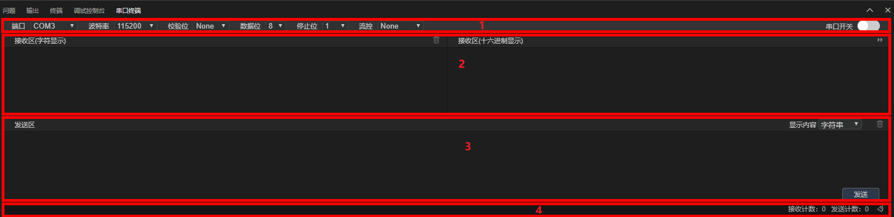
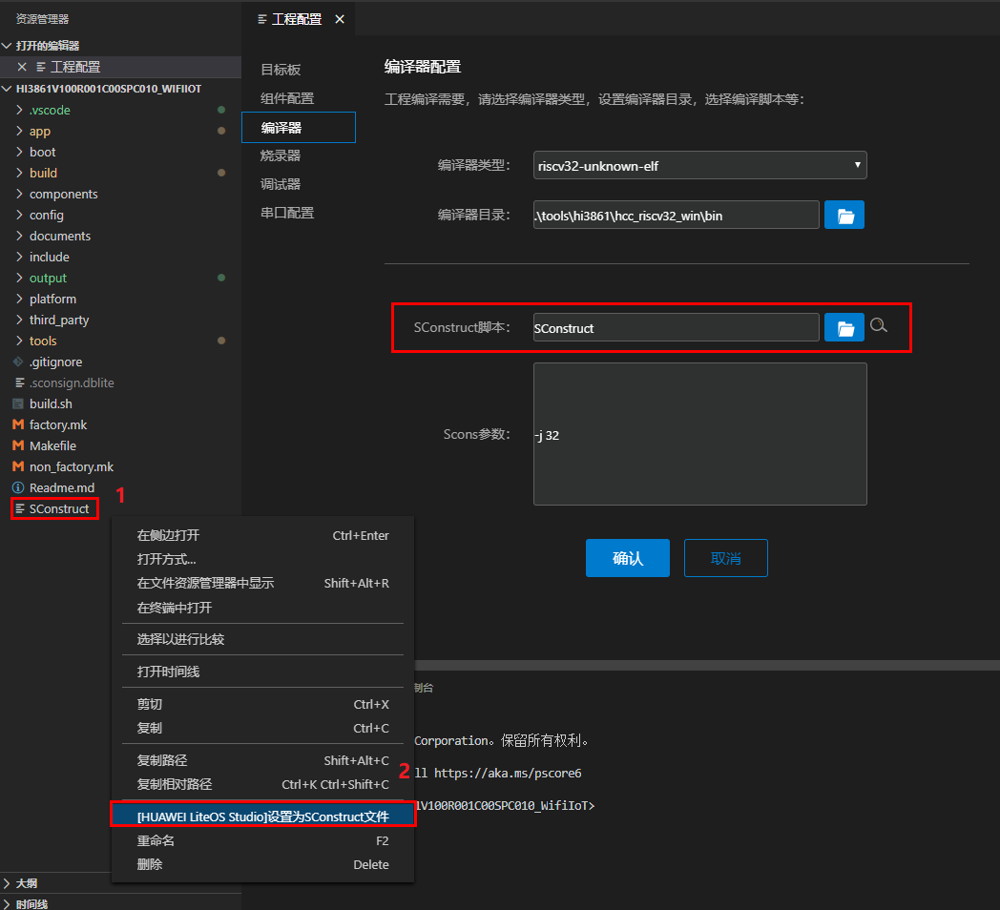

  <h1 align="center">HUAWEI LiteOS Studio界面介绍</h1>

### 主界面介绍
`HUAWEI LiteOS Studio`工程界面构成如下：

**区域1：**	菜单栏。

**区域2：**	侧边栏。

**区域3：**	工程树，由项目工程文件构成，可进行快速新建及打开文件等操作。

**区域4：**	调试工具栏，可进行编译、烧录、调试等操作。

**区域5：**	代码编辑区。

**区域6：**	控制台输出界面。

### 工具栏介绍

工具栏界面如下：

**新建文件**	单击新建文件图标 (`Ctrl+N`)，新建一个空文件。

**打开工程**	单击打开工程图标 (`Ctrl+K Ctrl+O`)，打开本地已有的工程。

**新建工程**	单击新建工程图标，进入新建工程向导界面，可远程下载一个LiteOS工程的SDK。

**撤销/恢复**	单击撤销/恢复图标  (`Ctrl+Z/Ctrl+Y`)，实现撤销/恢复上一步操作。

**前进/后退**	单击前进/后退图标  (`Alt+LeftArrow/Alt+RightArrow`)，跳转到浏览历史中上一个/下一个页面。
 
**编译**	单击编译图标 (`F7`)，对当前打开工程进行编译。

**清理编译**	单击清理编译 (`F6`)，删除上一次编译生成的文件。

**重新编译**	单击重新编译 (`Alt+F7`)，删除上一次编译生成的文件，再次执行编译。

**停止编译**	单击停止编译 (`Ctrl+Shift+F7`)，停止正在进行的编译。

**烧录**	单击烧录 (`F8`)，将程序烧录至目标板。

**重启目标板**	单击 (`Ctrl+Shift+F9`)，重启开发板。

**开始调试**	单击 (`F5`)， 启动调试。 

**串口终端**	单击， 打开串口终端界面。

**工程配置**	单击 (`F4`)，打开工程配置界面。

### 串口终端界面介绍
通过单击打开串口终端界面。

 
 
串口终端界面从上到下分为4块区域：

**1号区域：**	串口的设置和开关。

***端口：***	在下拉框中选择与目标板连接的实际串口号

***波特率：***	115200（默认），请根据实际情况修改

***校验位：***	None（默认），请根据实际情况修改

***数据位：***	8（默认），请根据实际情况修改

***停止位：***	1（默认），请根据实际情况修改

***流控：***	None（默认），请根据实际情况修改

***串口开关：***	默认为关闭，使用时需要手动打开串口开关

**2号区域：**	串口数据接收区，左边显示字符串，右边显示16进制，暂未设定接收数据量限制。

**3号区域：**	串口数据发送区，通过右上角的下拉菜单来切换数据内容由字符串显示还是16进制显示，通过“发送”按钮将数据发送给连接的目标板。

**4号区域：**	展示接收和发送数据的计数，并可以将计数清零。

以`WiFi IoT`开发板为例，下图是接收数据的展示：

 

### 新建工程界面介绍
通过单击新建工程图标打开新建工程界面。 新建工程使用`git`进行SDK下载，需要预置`git for windows`工具，可访问[git for windows官网](https://gitforwindows.org/)自行下载`git`工具。

 

 **工程名称：**	在输入框中填写自定义的工程名称，作为`SDK`工程的根目录文件夹名。

 **工程目录：**	在输入框中填写`SDK`工程的本地存储路径，建议路径名中不要包含中文、空格、特殊字符等。

 **SDK版本：**	在下拉框中选择`LiteOS`的不同版本，从而在开发板信息表中显示不同版本支持的开发板。

 **开发板信息表：**	页面下半区域的表格面板，能够展示所选版本支持的开发板信息，包括开发厂商、开发板名称、对应设备名称与内核名称。

 **注意：** 
 新建工程时需要保证网络畅通。如果联网需要代理，请提前配置好代理，否则新建工程会失败。配置代理方法参考[常见问题](/studio_qa?id=新建工程失败问题)。

### 工程配置界面介绍
通过工具栏中的按钮打开工程配置界面。

#### 目标板配置界面介绍 
点击工程配置页面左侧的`目标板`选项进入目标板配置界面，选择目标板信息面板上的一行，点击确认按钮保存设置，即指定了当前工程的开发板，后台将根据开发板设置默认的编译、烧录等配置信息。

  

通过添加厂商、内核名称两个筛选条件，也可以展示筛选后支持的开发板信息。

#### 组件配置界面介绍
点击工程配置页面左侧的`组件配置`选项进入组件配置界面，首次启动仅展示本地已有的组件。点击左侧组件列表，在右侧组件属性栏通过勾选为组件使能，或输入具体的参数值，点击确认按钮保存后，`HUAWEI LiteOS Studio`将在后台打开组件对应的宏开关，将使能的组件与更新后的属性值加入编译。

**注意：** 目前仅`WiFi IoT`开发板`Hi3861V100`支持组件化配置。

  

#### 编译器界面介绍
点击工程配置页面左侧的`编译器`选项进入编译器界面。

**编译器类型：** `编译器类型`下拉菜单目前支持`arm-none-eabi`、`riscv32-unknown-elf`两种编译器，分别适用于ARM架构和RISC-V架构，默认已经配好，如无额外需求不需要用户配置。

**编译器目录：** `编译器目录`是用户所使用的编译器所在目录，`HUAWEI LiteOS Studio`不提供编译器预置，需要用户自行安装。

* `arm-none-eabi`可参考[安装arm-none-eabi软件](/install?id=安装arm-none-eabi软件)，通过本站安装程序下载，如通过此方法下载，`编译器目录`可保持默认路径不变。如使用本地的编译器，`编译器目录`填写`arm-none-eabi-gcc.exe`所在路径。
* `riscv32-unknown-elf`编译器可联系`HUAWEI LiteOS Studio`技术支持人员获取，`编译器目录`填写`riscv32-unknown-elf-gcc.exe`所在路径。

**Make构建器：** `Make构建器`配置项仅在开发板支持`Makefile`脚本与`arm-none-eabi`编译方式时出现，`HUAWEI LiteOS Studio`不提供构建器预置，需要用户自行安装。可参考[安装Make构建软件](/install?id=安装Make构建软件)，通过本站安装程序下载，如通过此方法下载，`Make构建器`目录可保持默认路径不变。如使用本地的`Make构建器`，`Make构建器`路径填写`make.exe`所在路径。

**Makefile/SConstruct脚本：** `Makefile脚本`和`SConstruct脚本`是按照目标板的编译架构不同，所显示的编译脚本路径配置项，目前`HUAWEI LiteOS Studio`支持`Makefile`和`Scons`两种编译脚本，支持自动配置与手动配置。编译脚本路径建议不要包含中文、空格、特殊字符，避免编译失败。

* 手动配置脚本有两种方式可以配置：
  - 方式一：点击文件夹图标浏览目录自行配置。
  - 方式二：在`Makefile`或`SConstruct`文件上按照`单击右键->设置为MakeFile/SConstruct文件`步骤完成设置，设置完成后会自动在编译脚本路径配置框中填入脚本路径，如下图所示：

    

* 自动配置脚本：点击自动搜索脚本按钮自动匹配当前开发板对应的`Makefile/SConstruct脚本`，如果自动搜索结果为空，或使用该搜索结果导致编译报错，可能由于工程脚本名称、路径等发生改变，可改为手动配置方式设置脚本路径。

**Make/SCons参数：** `参数`是用户执行编译时可以自行添加的参数，例如 -j 32等，需要用户自行配置。

填写完成后，点击确认按钮保存用户配置，此时可以通过单击编译图标，对当前工程进行编译。

#### 烧录器界面介绍
点击工程配置页面左侧的`烧录器`选项进入烧录器界面。

**烧录方式：** `烧录方式`下拉菜单目前支持`JLink`、`HiBurner`、`OpenOCD`三种烧录器，默认已经配好，如无额外需求不需要用户配置。

**烧录器目录：** `烧录器目录`是用户所使用的烧录器所在目录。
- HiBurner烧录器目录：`HUAWEI LiteOS Studio`仅预置`HiBurner`烧录器，默认安装在`C：//users/用户名/.huawei-liteos-studio/tools`下，不需要用户自行配置此目录。
- JLink烧录器目录：`JLink`需要用户自行下载安装，推荐下载地址：
<a href="https://www.segger.com/downloads/jlink/" target="_blank">`https://www.segger.com/downloads/jlink/`</a>，下载后需要将`JLink.exe`所在目录加入系统的Path环境变量。烧录器目录填写`JLink.exe`所在路径。
- OpenOCD烧录器目录：`OpenOCD`需要用户自行下载安装，推荐下载地址：
<a href="https://sourceforge.net/projects/openocd/files/openocd/0.10.0-rc2/" target="_blank">`https://sourceforge.net/projects/openocd/files/openocd/0.10.0-rc2/`</a>，烧录器目录填写`openocd.exe`所在路径。

**烧录文件：** `烧录文件`是用户编译生成的文件，目前支持`bin`、`fwpkg`、`hex`三种格式。执行编译后，后台将保存生成的烧录文件（`bin`、`fwpkg`、`hex`后缀的文件），并填入`烧录文件`下拉菜单中供用户点选，用户也可以在`bin`、`fwpkg`或`hex`文件上`单击右键->设置为烧录文件`或点击文件夹图标浏览目录自行配置。

其他配置项`连接方式`、`连接速率`、`加载地址`、`传输模式`等，可根据开发板及用户需求自行配置。

填写完成后，点击确认按钮保存用户配置，此时可以通过单击烧录图标，对当前工程进行烧录。

#### 调试器界面介绍
点击工程配置页面左侧的`调试器`选项进入调试器界面。

调试器界面包括`调试器`、`端口`、`连接方式`、`连接速率`、`调试器目录`、`GDB目录`、`调试配置`等，默认已为用户配好，用户如有额外需求，可自行配置。

**可执行文件路径：** 执行编译后，后台将保存生成的调试可执行文件（`elf`、`out`后缀的文件）路径，并填入`可执行文件路径`下拉菜单中供用户点选，用户也能通过手动输入或点击文件夹图标浏览目录自行配置。

**调试配置：** `调试配置`中可选择复位调试和附加调试两种调试方式。

#### 串口配置界面介绍
点击工程配置页面左侧的`串口配置`选项进入串口配置界面。

串口配置界面包括`端口`、`端口状态`、`波特率`、`数据位`、`停止位`、`奇偶`、`流控`等，大多选项默认已为用户配好，用户如有额外需求，可自行配置。

**端口：** `端口`表示开发板使用的端口号，一般使用Hiburn烧录的开发板在烧录前需要用户手动配置，通过系统的设备管理器界面来判断当前使用的端口号。

**端口状态：** `端口状态`能够实时显示端口是否被占用。

