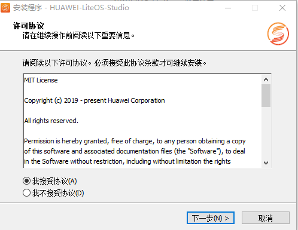
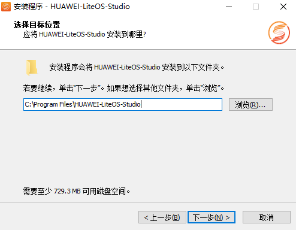
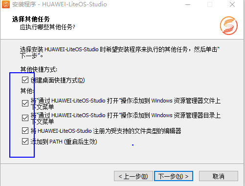
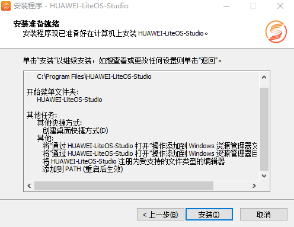
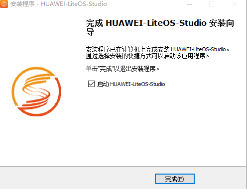

  <h1 align="center">HUAWEI LiteOS Studio安装</h1>

`HUAWEI LiteOS Studio`是以`Visual Studio Code`的社区开源代码为基础，根据`LiteOS`嵌入式系统软件开发语言、业务场景等特点开发的一款轻量

级定制集成开发环境解决方案。它提供了代码编辑、编译、烧录、调试及Trace跟踪等功能，可以对系统关键数据进行实时跟踪，保存与回放。

### 获取安装文件

获取`HUAWEI LiteOS Studio`安装包`HUAWEI-LiteOS-Studio-Setup-x64-X.XX.X.exe`，xxxx为`LiteOS Studio`版本号，请以实际获取的安装包版本号为准。

双击`HUAWEI-LiteOS-Studio-Setup-x64-X.XX.X.exe`，依照屏幕提示，安装`HUAWEI LiteOS Studio`集成开发环境。

### 安装指导

**接受许可协议**	 
需要阅读并接受许可协议，才可以继续安装。选中`我接受协议(A)`，点击`下一步`。

**选择目标位置**	 
使用默认，或者设置程序的安装位置，点击`下一步`。

**选择快捷方式**	 
推荐全部勾选，在桌面上使用快捷方式，或在资源管理器文件夹内右键菜单，均可以快速打开程序`HUAWEI LiteOS Studio`。点击`下一步`。

**安装准备就绪**	 
点击`安装`按钮执行安装即可。

安装完成后，界面如下：

