<p align="center">
  <h1 align="center">Hi2120GFCV100 NB IoT工程示例</h1>
</p>

介绍如何使用LiteOS Studio 编译、烧录、调试NB IoT工程。

### 准备Windows开发环境

需要预先检出`NB-IoT`源代码和编译构建工具目录`buildtools`, 二者需要在同一级目录下，编译时依赖相对路径查找编译器。

### 工程示例

演示工程管理，编译、烧录、GDB调试等功能。

#### 新建工程

目前不支持新建工程，只能打开现有的`NB IOT`源代码目录。

#### 打开工程

这里演示如何打开存在的`NB IOT`源代码目录：

**步骤 1** 打开LiteOS Studio


**步骤 2** 菜单选择`文件File -> 打开文件夹Open Folder`，选择`NB IOT`源代码所在的目录打开，在`资源管理器`可以看到源代码工程文件。

#### 工程配置-目标板选择

**步骤 1** 点击工具栏上的工程设置图标，打开工程配置界面。

**步骤 2** 点击`目标板`，选取`Hi2120GFCV100`，点击确认按钮进行保存。

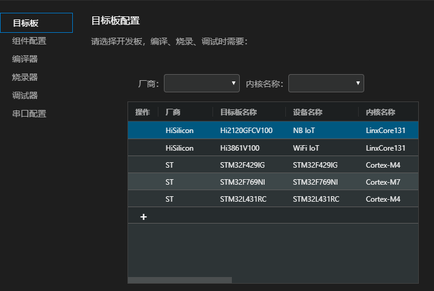

#### 编译配置-编译代码

**步骤 1** 点击工程配置界面上的`编译器`

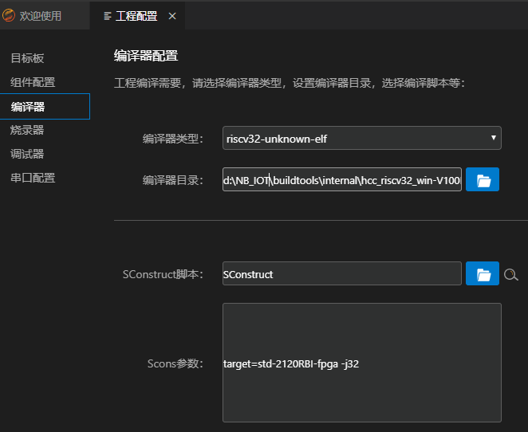

**步骤 2** `编译器类型`使用默认的`riscv32-unknown-elf`

**步骤 3** `编译器目录`已自动识别`hcc_riscv32_win`编译器目录，也可以点击图标进行自定义设置

**步骤 4** `SConstruct脚本`可以点击图标浏览打开`SConstruct脚本`，或者在`资源管理器`中找到`SConstruct`文件，右键 选择`[HUAWEI LiteOS Studio]设置为SConstruct文件`进行自定义设置，还可以使用按钮自动搜索脚本文件

**步骤 5** `Scons参数`，如果需要编译`App`，参数为`target=std-2120RBI-fpga -j32`, 如果需要编译`test-suite`，参数为`target=testsuite-2120RBI -j32`。

也可以根据情况进行更改。

**步骤 6** 配置好后点击确认按钮进行保存

**步骤 7** 点击工具栏上的编译图标  进行编译代码，也可以点击清理图标  和重新构建图标进行清理和重新编译

编译成功的截图示例如下：

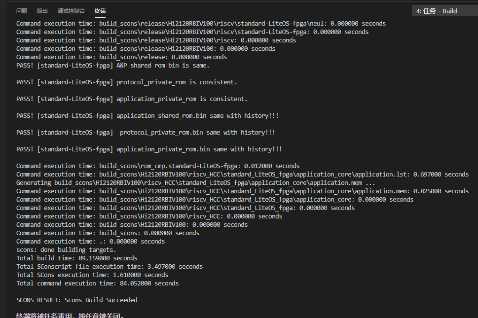

清理编译输出的截图示例如下：

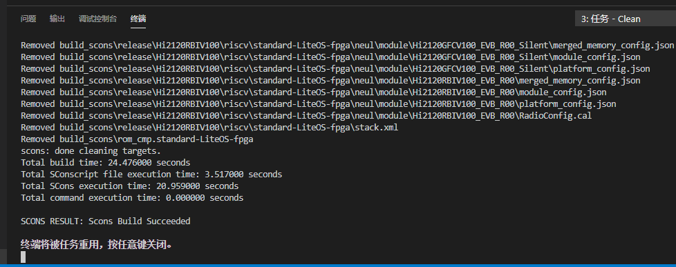

#### 烧录配置-烧录

**前提条件：**

- 烧录前，确保`FPGA JTAG、JLink仿真器、USB转串口`等正确连接。

- 不需要调用`Hi2120_Security_Commandline.bat`修改寄存器，已经集成在烧录工具

- 使用软件`Vivadi Lab Edition 2017.2`烧写逻辑文件`hi2120_100nl_apsrom_final_normal_05072206.bit`。

**步骤 1** 点击工程配置界面上的`烧录器`


**步骤 2** `烧录方式`选择`HiBurner`

**步骤 3** `烧录器目录`已提供默认路径，也可以点击图标进行自定义设置

**步骤 4** 点击`烧录文件`后的图标选择编译生成的`fwpkg`文件，或者使用如下图所示方式选择烧录文件:

 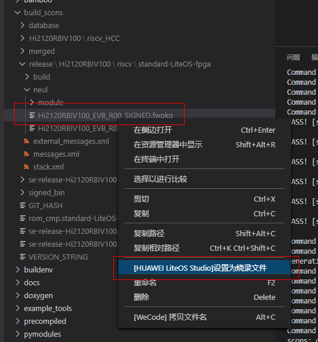

还可以通过下拉框的方式，选择烧录文件:

 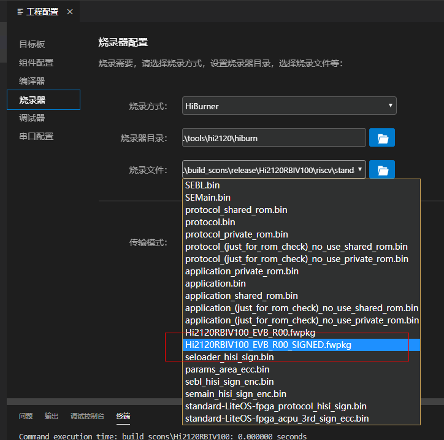

 `target std-2120RBI-fpga`的烧录文件位置为：

 `build_scons\release\Hi2120RBIV100\riscv\standard-LiteOS-fpga\neul\Hi2120RBIV100_EVB_R00_SIGNED.fwpkg`

**步骤 5** 配置好后点击进行保存

**步骤 6** 点击工程配置界面上的`串口配置`

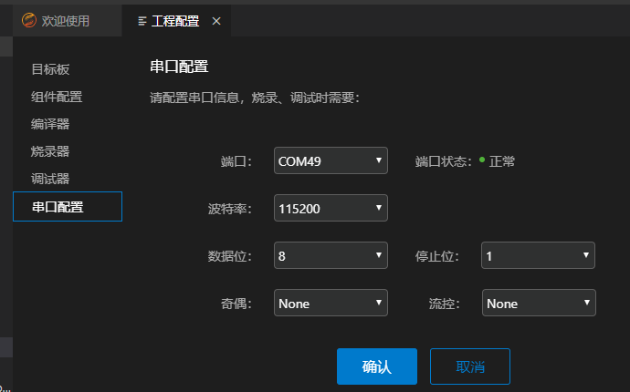

**步骤 7** 根据实际情况进行`端口`设置

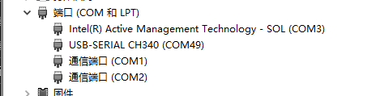

**步骤 8** 设置`波特率`为`115200`, NB IoT当前使用`FPGA`，暂不支持`921600`。

**步骤 9** 配置好后点击进行保存

**步骤 10** 点击工具栏上的图标进行烧录

弹出烧录进度框，提示用户复位RESET开发板：

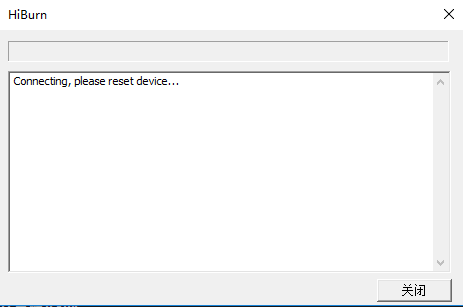

烧录成功的截图如下，点击关闭按钮，关闭烧录弹窗。

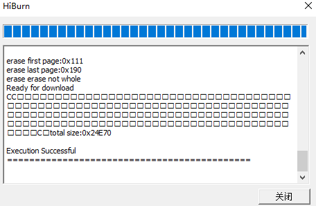

**步骤 11** 烧录成功后，选择`查看`-`串口工具`，设置端口，开启串口开关，
开发板按下复位RESET按钮，可以看到串口输出，烧录成功。

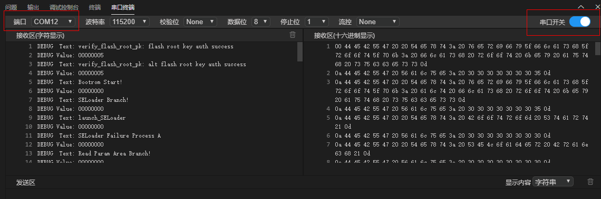

#### 调试器-执行调试

LiteOS Studio 调测配置非常简单，只需要几步，即可支持NB-IoT 图形化单步调试。

**步骤 1** 点击工程配置界面上的`调试器`

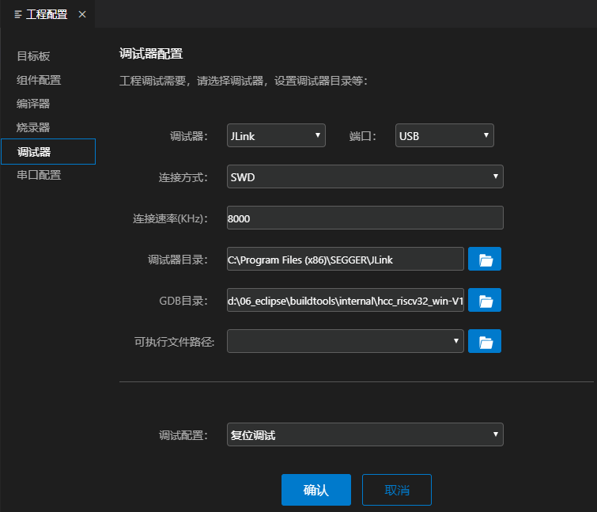
 
**步骤 2** `调试器`选择`JLink`

**步骤 3** `连接方式`选择`SWD`, `连接速率`可以默认或者自行指定

**步骤 4** `调试器目录`选择`JLink`的安装目录

**步骤 5** `GDB目录`可以默认，或者自行指定

**步骤 6** `可执行文件路径`在编译后会自动配置到文件中，可以默认，或自行指定

**步骤 7** `调试配置`根据需要，选择`复位调试`或`附加调试`。

***`复位调试`*** 会自动重启开发板，并停止在main函数

***`附加调试`*** 不重启开发板，附加到当前运行代码行

配置好后点击确认按钮进行保存

**步骤 7** 打开调试视图，根据需要，选择`A核`的调试配置`Application Debug`或`P核`的调试配置`Protocol Debug`, 点击绿色三角按钮，开始调试

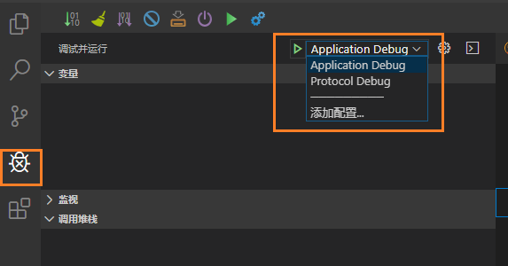

**步骤 8** 调试界面如下：

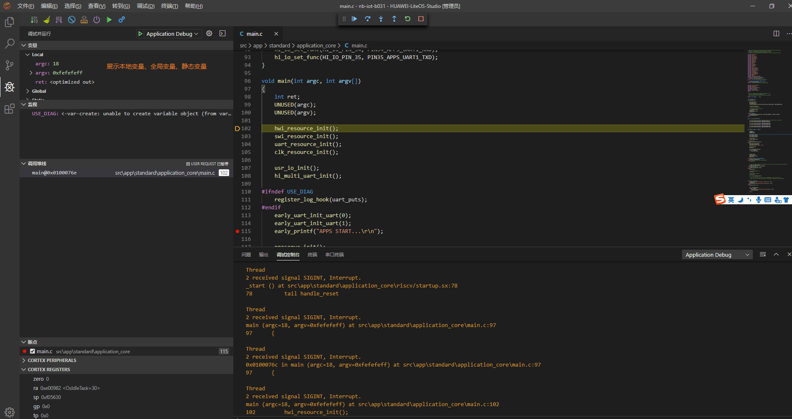

***变量**     展示本地变量、全局变量、静态变量

***监视**     监视指定的表达式

***调用堆栈** 展示当前的调用堆栈

***断点**     展示设置的断点

***寄存器**     查看各个寄存器的数值，支持复制数值操作

***反汇编 & 内存**     支持对函数进行反汇编，支持查看内存操作。

***输出**     展示`GDB`客户端的输出日志

***调试控制台**     展示`GDB Server`的输出日志

#### 调试器-断点 监视点

在代码行号处单击可以添加断点，或者右键点击，支持`条件断点`、`记录点`等

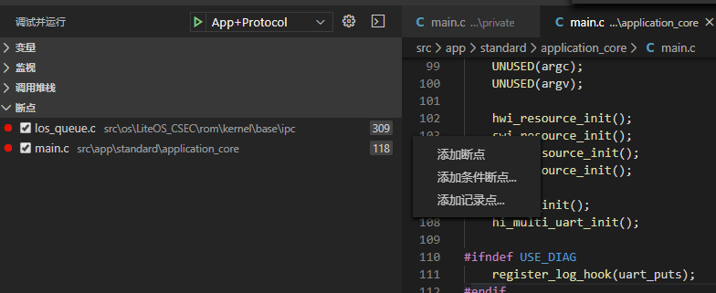

选中代码文件中的变量或表达式，右键上下文菜单，可以添加监视点：

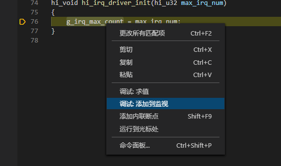

#### 调试器-寄存器

在`调试面板-寄存器`视图，可查看开发板寄存器的数值。右键可复制寄存器值。

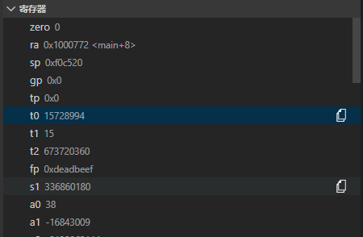

#### 调试器-多线程调测

LiteOS作为轻量级物联网操作系统，同时只能运行一个Task任务线程。在调试时，只能展示当前运行状态的任务线程的调用堆栈。通过多线程感知调测技术，

在调测时，可以展示`Running运行`状态和`Pending暂停`状态的任务线程的调用堆栈，提供更加强大的调试能力。

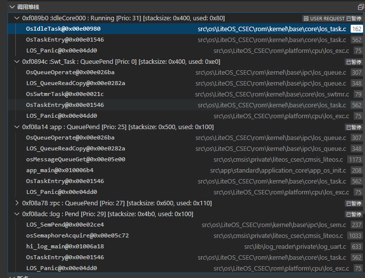

点击调用堆栈中的栈帧可以跳转到对应的源文件。当在不同任务的栈帧中切换时，`变量`视图会同步更新展示。

**<font color='red'>注意：</font><bont>**

经编译器团队同事确认，由于`riscv32-unknown-elf-gdb.exe`计算`sp`寄存器错误导致回溯栈错误，目前可以暂时通过关闭编译选项`-mpush-pop`来规避：

该文件在`tools\SCons\riscv_tools.py`文件中：

```
   # Set CCFLAGS
    CCFlags = NeulBuildConfig.COMMON_CCFLAGS + [
        ......
        #'-mpush-pop',
        ......
    ] + PROCESSOR_CCFlags
    env.Append(CCFLAGS =  CCFlags )
```

#### 调试器-反汇编

在单步调测时，调测面板`反汇编&内存`中，支持查看对应源代码的反汇编代码，支持如下两种方式：

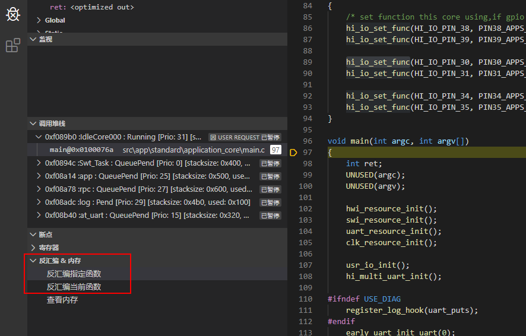

**反汇编指定函数**  通过输入函数名称，展示指定函数的反汇编代码。 

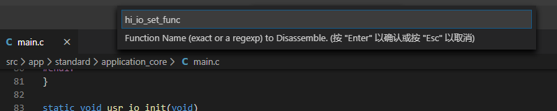

**反汇编当前函数**   自动展示当前任务栈函数的反汇编代码。

反汇编文件展示效果如下：

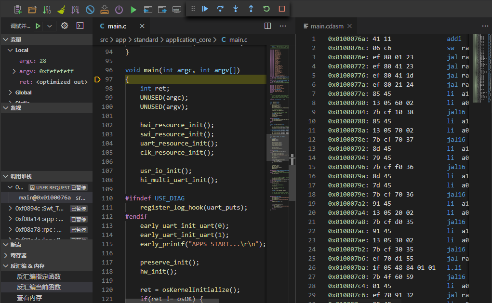

#### 调试器-查看内存

调测面板`反汇编&内存`中，点击`查看内存`，通过指定内存起始地址及长度，可以展示开发板的内存信息。

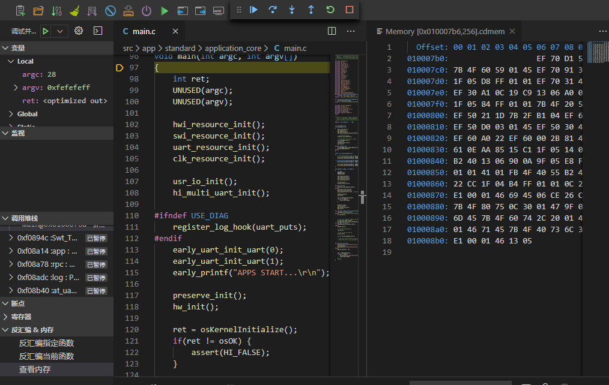

#### 调试器-多核调测

支持同时调测`A核`和`P核`，在调试配置下拉框选择`App+Protocol`,按`F5`快捷键或者点击绿色按钮启动多核调测：

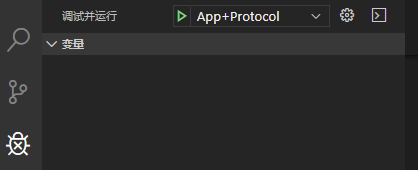 

多核同时调测的效果图如下，可以在顶部的调测工具栏里切换不同的调试会话，选择`Application Debug`和`Protocol Debug`调测会话分别进行调试。
在调测面板的`调用堆栈`也按调试会话进行分类。
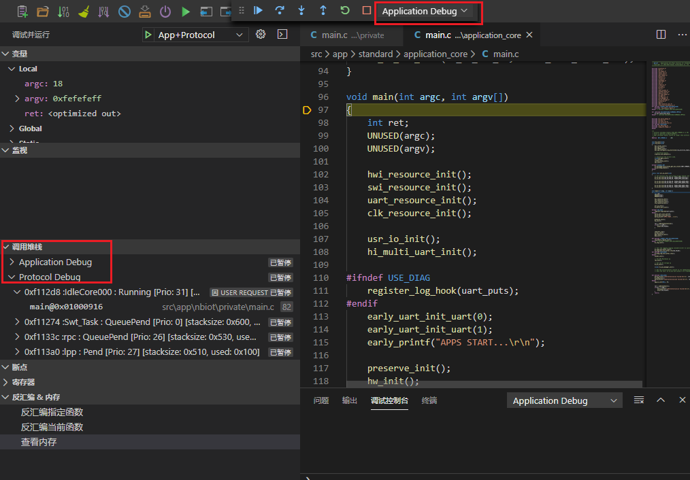 