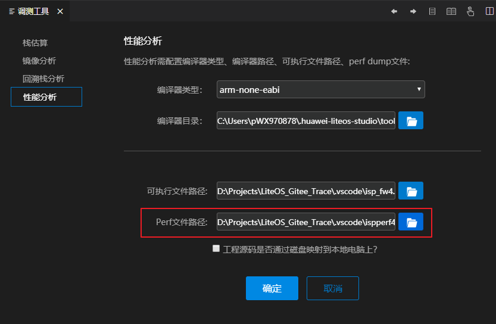

  <h1 align="center">性能分析工具</h1>

LiteOS Studio可对输出的perf文件进行热点函数和热点路径分析，且支持反汇编文件跳转。

### 1、性能分析页面入口
> 打开Liteos Studio工具，点击调测工具里的性能分析tab页签，设置编译器、可执行文件路径等，选择perf文件（目前仅支持后缀为.data的文件），然后点击确定进入性能分析页面。

> 或者通过打开命令行输入`perf`找到`Perf`点击进入。

### 2、性能分析相关配置
性能分析依赖工程的可执行文件（如elf文件、bin文件）、编译器类型、编译器路径，需在调测工具设置界面进行相关设置。

如果工程源码在linux上，可将工程映射到windows磁盘上，然后进行相关路径配置如下图所示。

### 3、性能分析页面介绍
性能分析页面包含搜索框，section id和cpu id可以用来筛选sectionId以及cpuId，页面展示性能分析的数据。刷新按钮可以重新执行性能分析。如果百分数大于15%显示红色，大于0.5%小于15%显示绿色。

切换sectionId和cpuId筛选结果。

#### 快捷键介绍
除了可以通过鼠标操作节点，也可以使用键盘上下键上下切换数据，在父节点上通过回车键可以展开收起子节点，在子节上按回车键可以跳转页面。

#### 反汇编文件
通过点击子节点或者在子节点上按回车键可以跳转到对应反汇编文件并定位到该函数对应的行。

