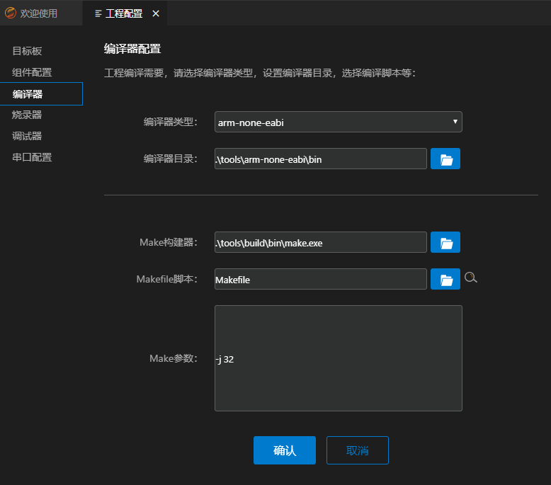

<!-- markdownlint-disable MD033 MD041-->

  <h1 align="center">STM32工程示例</h1>

本节介绍如何使用`HUAWEI LiteOS Studio` 开发`STM32`开发板工程。[开源LiteOS](https://gitee.com/LiteOS/LiteOS)工程中，支持`STM32F429IG`、`STM32F769NI`、`STM32L431RC`、`STM32F103ZE`等`STM32`系列开发板。

### 搭建Windows开发环境

用户需要根据实际需求情况，安装`GNU Arm Embedded Toolchain Version 9-2019-q4-major`编译交叉工具链、`Make.exe`构建工具、`JLink`仿真器、`git for windows`工具。

对于一些`STM32`开发板，用户可能还需要安装USB转串口驱动。

#### 安装git for windows工具

如果用户需要使用新建工程功能下载开源工程SDK， 则应根据情况安装`git for windows`工具。 可参考[git工具安装](/install?id=安装Git工具)。

#### 安装GNU Arm Embedded Toolchain软件

<a href="https://gitee.com/LiteOS/LiteOS" target="_blank">`开源LiteOS`</a>工程使用`ARM GCC`编译器进行编译， 需要安装编译器软件。 可参考[Arm工具安装](/install?id=安装arm-none-eabi软件)，通过本站安装程序下载.

**注意：通过本站提供的下载程序下载`GNU Arm Embedded Toolchain`，需要先安装`git for windows`工具，并加入环境变量。**

#### 安装GNU Make等构建软件

<a href="https://gitee.com/LiteOS/LiteOS" target="_blank">`开源LiteOS`</a>工程使用`Makefile`文件组织编译和链接程序，我们需要安装`GNU Make`工具。可参考[Make工具安装](/install?id=安装Make构建软件)，通过本站安装程序下载。

**注意：通过本站提供的下载程序下载`GNU Make`，需要先安装`git for windows`工具，并加入环境变量。**

#### 安装JLink仿真器软件

如果开发板使用`JLink`仿真器， 则根据情况安装`JLink`软件。 从<a href="https://www.segger.com/downloads/jlink/" target="_blank">`https://www.segger.com/downloads/jlink/`</a>下载，并按安装向导完成最新版`JLink`的安装。

建议将`JLink.exe`所在目录加入`PATH`环境变量。

#### 安装OpenOCD工具（可选）

如果用户需要使用`OpenOCD`完成烧录， 则应根据情况安装`OpenOCD烧录工具`。

### 使用入门

演示如何新建工程、编译、烧录、串口调试、`GDB`图形化单步调测等功能。

#### 新建工程（可选）

**注意：** 当本地已有工程/源码时，无需再新建工程，直接进入下一步`打开工程`。

通过点击`新建工程`图标，打开新建工程界面。在使用`HUAWEI LiteOS Studio`新建`STM32`工程时，需要联网，确保可以访问[开源LiteOS](https://gitee.com/LiteOS/LiteOS)。如果联网需要代理，请提前配置好代理，否则新建工程会失败。配置代理方法参考[常见问题](/studio_qa?id=新建工程失败问题)。同时，需要确保本地已安装`git for windows`工具。

**步骤 1** 在`工程名称`中填入自定义的工程名

**步骤 2** 在`工程目录`中填入或选择工程存储路径

**步骤 3**  选择SDK版本号，当前STM32工程被维护在`https://gitee.com/`，支持最新版本`master`分支

**步骤 4**  在开发板信息表点选开发板所在行，目前默认提供`STM32F429IG`、`STM32L431RC`、`STM32F103ZE`、`STM32F769NI`四种开发板

点击`确认`按钮，后台下载并保存所选目标板的SDK，等待下载完成后会自动重新打开一个新窗口并自动打开用户新建的工程。

#### 打开工程

新建工程后，会自动打开工程。这里演示如何打开存在的工程：

**步骤 1** 打开`HUAWEI LiteOS Studio`

**步骤 2** 点击`打开工程`图标，选择工程所在的目录

#### 目标板配置-选择目标板

**步骤 1** 点击工具栏上的工程设置图标，打开工程配置界面

**步骤 2** 点击`目标板`，选取当前工程对应的开发板，下面以`STM32F429IG`作为示例，点击确认按钮进行保存

#### 编译配置-编译代码

**步骤 1** 点击工程配置界面上的`编译器`

**步骤 2** `编译器类型`选择`arm-none-eabi`

**步骤 3** `编译器目录`用户需要自行下载`GNU Arm Embedded Toolchain Version 9-2019-q4-major编译交叉工具链`，已提供默认路径， 用户可以将`arm-none-eabi`编译器安装到该路径下，也可自行指定安装目录，点击图标设置为`arm-none-eabi-gcc.exe`所在路径

**步骤 4** `Make构建器`用户需要自行下载`Make.exe构建工具`，已提供默认路径， 用户可以将`Make.exe构建工具`安装到该路径下，也可自行指定安装目录，点击图标设置为`make.exe`所在路径

**步骤 5** `Makefile脚本`路径需要用户自行填入，对于STM32工程，通常在`targets/开发板名/gcc`路径下的`Makefile`文件上点击右键->设置为Makefile文件，或点击图标

进行自定义设置，也可使用按钮自动搜索脚本文件

**步骤 5** 配置好后点击确认按钮进行保存

**步骤 6** 点击工具栏上的编译图标  进行编译代码，也可以点击重新构建图标  进行清理和重新编译

编译成功的截图示例如下：

清理编译输出的截图示例如下：

#### 烧录配置-烧录

**步骤 1** 点击工程配置界面上的`烧录器`

**步骤 2** `烧录方式`选择`JLink`。如果目标板是`STM23L431RC`、`STM32F769NI`，建议刷成`JLInk`进行调测， 详细操作方法参考[ST-Link仿真器单步调测](/project_stm32?id=工程示例-st-link仿真器单步调测)

**步骤 3** `烧录器目录`已提供默认路径，也可以点击图标进行自定义设置

**步骤 4** 点击`烧录文件`后的图标或者使用如下图所示方式手动选择烧录文件

 

也可点击下拉菜单选择自动匹配的烧录文件

**注意：如果用户安装的`JLink`目录不是Studio默认填入的`C:\Program Files (x86)\SEGGER\JLink`，请在`烧录器目录`重新根据实际安装目录进行填写。<bont>**

**步骤 5** `连接方式`、`连接速率`、`加载地址`等保持默认，或根据实际开发板进行调整。配置好后点击进行保存

**步骤 6** 点击工程配置界面上的`串口配置`

**步骤 7** 根据实际情况进行`端口`设置

比如下图中，使用的`USB`转串口的端口为`19`:

**步骤 8** 设置`波特率`为`921600`， `数据位`、`停止位`、`奇偶`、`流控`保持默认即可

**步骤 9** 配置好后点击进行保存

**步骤 10** 点击工具栏上的图标进行烧录

烧录成功的截图如下：

**步骤 11** 烧录成功后，点击`串口终端`图标打开串口终端界面，设置端口，开启串口开关，开发板按下复位`RESET`按钮，可以看到串口输出

#### 调试器-执行调试

`HUAWEI LiteOS Studio` 调测配置非常简单，只需要几步，即可支持`STM32`开发板的图形化单步调试。

**步骤 1** 点击工程配置界面上的`调试器`

**步骤 2** `调试器`根据实际情况选择`JLink`或者`OpenOCD`

**步骤 3** `连接方式`根据需求选择`SWD`或`JTAG`， `连接速率`可以默认或者自行指定

**步骤 4** `调试器目录`需要指定用户的具体安装目录，如果与实际安装目录不一致，调试可能失败

**步骤 5** `GDB目录`需要用户指定编译器目录，可参考编译器界面填写

**步骤 6** `可执行文件路径`完成编译后，可填入路径或点击图标进行手动设置，也可以点击下拉菜单选择自动匹配的可执行文件

**步骤 6** `调试配置`根据需要，选择`复位调试`或`附加调试`

***`复位调试`*** 会自动重启开发板，并停止在main函数

***`附加调试`*** 不重启开发板，附加到当前运行代码行

配置好后点击确认按钮进行保存， 会根据用户指定的设置自动生成调测配置。

**步骤 7** 点击打开`调试并运行`视图，选择调试配置`JLINK Debug`， 点击绿色三角按钮，开始调试

如果`调测器`配置为`OpenOCD`，则显示的是`OpenOCD Debug`。

**步骤 8** 调试界面如下：

***变量**     展示局部变量、全局变量、静态变量

***监视**     监视指定的表达式

***调用堆栈** 展示当前的调用堆栈

***断点**     展示设置的断点

***寄存器**     查看各个寄存器的数值，支持复制数值操作

***反汇编 & 内存**     支持对函数进行反汇编，支持查看内存操作。

***输出**     展示`GDB`客户端的输出日志

***调试控制台**     展示`GDB Server`的输出日志

#### 调试器-断点 监视点

在代码行号处单击可以添加断点，或者右键点击，支持`条件断点`、`记录点`等。

选中代码文件中的变量或表达式，右键上下文菜单，可以添加监视点：

#### 调试器-寄存器

在`调试面板-寄存器`视图，可查看开发板寄存器的数值。右键可复制寄存器值。

#### 调试器-多线程调测

LiteOS作为轻量级物联网操作系统，同时只能运行一个Task任务线程。在调试时，只能展示当前运行状态的任务线程的调用堆栈。通过多线程感知调测技术，在调测时，可以展示`Running运行`状态和`Pending暂停`状态的任务线程的调用堆栈，提供更加强大的调试能力。

点击调用堆栈中的栈帧可以跳转到对应的源文件。当在不同任务的栈帧中切换时，`变量`视图会同步更新展示。

#### 调试器-反汇编

在单步调测时，调测面板`反汇编&内存`中，支持查看对应源代码的反汇编代码，支持如下两种方式：

**反汇编指定函数**  通过输入函数名称，展示指定函数的反汇编代码。

**反汇编当前函数**   自动展示当前任务栈函数的反汇编代码。

反汇编文件展示效果如下：

#### 调试器-查看内存

调测面板`反汇编&内存`中，点击`查看内存`，通过指定内存起始地址及长度，可以展示开发板的内存信息。

在弹窗中输入内存起始地址， 要展示内存的长度：

查看内存展示效果如下：

### 工程示例-ST-Link仿真器单步调测

对于板载`ST-Link`仿真器的`STM32`开发板，如`STM23L431RC`、`STM32F769NI`，为了更加稳定的调测体验，建议刷成`JLInk`进行调测。步骤如下：

#### STLinkReflash 刷JLINK固件

确保已安装`ST-LINK USB Drivers`和`J-Link`软件。 官方站点下载<a href="https://www.segger.com/downloads/jlink#STLink_Reflash" target="_blank">`ST-Link Reflash Utility`</a>，或<a href="/release/STLinkReflash_190812.zip" target="_blank">本站下载</a>。

**步骤 1** 接受许可Accept

解压`STLinkReflash.zip`， 双击`STLinkReflash.exe`运行，输入`A`接受许可协议。

**步骤 2** Upgrade to J-Link

选择`[1]`， 把开发板板载的ST-Link仿真器刷成J-Link仿真器。

**步骤 3** Restore ST-Link

如果想恢复ST-Link仿真器，可以选择`[3]`执行即可恢复。

#### 工程设置中切换为JLINK

**步骤 1** 烧录器切换为JLINK

**步骤 2** 调试器切换为JLINK

#### 执行调测

正常执行调测，如图：

