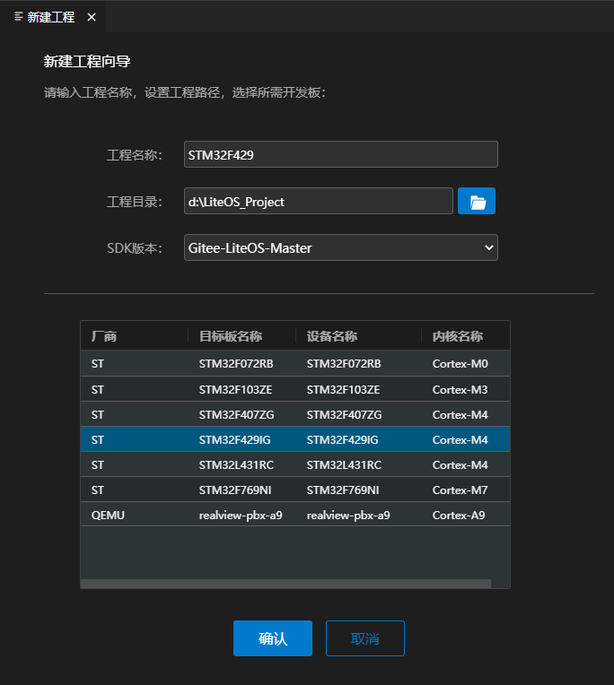
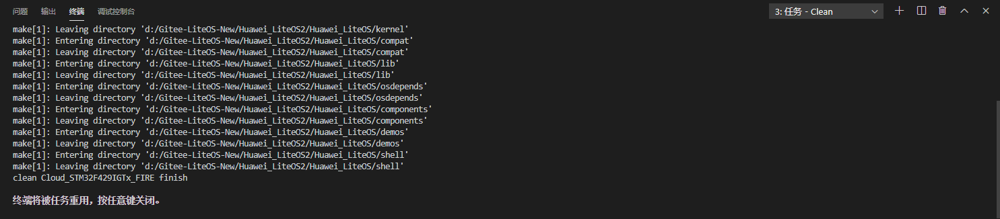

<!-- markdownlint-disable MD033 MD041-->

  <h1 align="center">STM32工程示例</h1>

本节介绍如何使用`HUAWEI LiteOS Studio` 开发`STM32`开发板工程。[开源LiteOS](https://gitee.com/LiteOS/LiteOS)工程，支持`STM32F429IG`、`STM32L431RC`、`STM32F769NI`等`STM32`系列开发板，以及支持Qemu仿真的`realview-pbx-a9`开发板。

### 搭建Windows开发环境

`STM32`工程使用`Makefile`进行构建管理， 需要安装`Python`和`Kconfiglib`库、`Make.exe`构建工具， 推荐`Python 3.7`以上版本。

`STM32`工程使用`GNU Arm Embedded Toolchain`编译交叉工具链，使用`JLink`仿真器。

如果使用`OpenOCD`烧录，还需要安装`OpenOCD`烧录工具。

如果选择`realview-pbx-a9`开发板进行仿真，还需要安装`Qemu`仿真器工具。

如果需要新建工程，还应该安装`git for windows`工具。

对于一些`STM32`开发板，用户可能还需要安装USB转串口驱动。

#### 安装git for windows工具

如果用户需要使用新建工程功能下载开源工程SDK，则应根据情况安装`git for windows`工具，可参考[安装Git工具](/install?id=安装Git工具)。

#### 安装GNU Make等构建软件

<a href="https://gitee.com/LiteOS/LiteOS" target="_blank">`开源LiteOS`</a>工程使用`Makefile`文件组织编译和链接程序，需要安装`GNU Make`工具，可参考[安装Make构建软件](/install?id=安装Make构建软件)。

#### 安装GNU Arm Embedded Toolchain软件

<a href="https://gitee.com/LiteOS/LiteOS" target="_blank">`开源LiteOS`</a>工程使用`ARM GCC`编译器进行编译，需要安装编译器软件，可参考[安装arm-none-eabi软件](/install?id=安装arm-none-eabi软件)。

#### 安装JLink仿真器软件

如果开发板使用`JLink`仿真器，则应根据情况安装`JLink`软件，可参考[安装JLink仿真器软件](/install?id=安装JLink仿真器软件)。

#### 安装Qemu仿真器软件

如果开发板使用`Qemu`仿真器，则应根据情况安装`Qemu`软件，可访问<a href="https://qemu.weilnetz.de/" target="_blank">`Qemu下载官网`</a>自行下载安装。

### 使用入门

演示如何新建工程、编译、烧录、串口调试、`GDB`图形化单步调测等功能。

#### 新建工程（可选）

**注意：当本地已有工程/源码时，无需再新建工程，直接进入下一步`打开工程`。**

通过点击`新建工程`图标，打开新建工程界面。在使用`HUAWEI LiteOS Studio`新建`STM32`工程时，需要联网，确保可以访问[开源LiteOS](https://gitee.com/LiteOS/LiteOS)。如果联网需要代理，请提前配置好代理，否则新建工程会失败。配置代理方法参考[常见问题](/studio_qa?id=新建工程失败问题)。同时，需要确保本地已安装`git for windows`工具。

**步骤 1** 在`工程名称`中填入自定义的工程名

**步骤 2** 在`工程目录`中填入或选择工程存储路径，路径名中不要包含中文、空格、特殊字符等

**步骤 3**  选择SDK版本号，当前STM32工程被维护在`https://gitee.com/`，支持最新版本`master`分支

**步骤 4**  在开发板信息表点选开发板所在行，目前默认提供`STM32F429IG`、`STM32L431RC`、`STM32F769NI`、`realview-pbx-a9`四种开发板

点击`确认`按钮，后台将下载并保存所选目标板的SDK，等待下载完成后会在一个新窗口中自动打开新建的工程。

#### 打开工程

新建工程后，会自动打开工程。如果需要打开存在的工程，点击`打开工程`图标，选择工程所在目录即可。

#### 目标板配置-选择目标板

**步骤 1** 点击工具栏上的工程设置图标，打开工程配置界面

**步骤 2** 点击`目标板`，选取当前工程对应的开发板，下面以`STM32F429IG`作为示例，点击确认按钮进行保存

#### 组件配置-组件使能与属性修改(可选)

如需对LiteOS开放可配置的组件与属性进行使能，而不是仅使用默认的配置，用户可以点击工程配置界面上的`组件配置`，在左侧的`选择组件`中点击想要使能或修改的组件，在右侧的`组件属性`栏勾选需要使能的组件，或更改组件属性值，点击确认按钮保存。

#### 编译配置-编译代码

**步骤 1** 点击工程配置界面上的`编译器`

**步骤 2** `编译器类型`选择`arm-none-eabi`

**步骤 3** `编译器目录`用户需要自行下载`GNU Arm Embedded Toolchain编译交叉工具链`，已提供默认路径。通过本站提供的自动下载程序，`arm-none-eabi`编译器就会安装到该路径下。用户也可自行指定安装目录，点击图标设置为`arm-none-eabi-gcc.exe`所在路径

**步骤 4** `Make构建器`用户需要自行下载`Make.exe构建工具`，已提供默认路径。通过本站提供的自动下载程序，`Make.exe构建工具`就会安装到该路径下。用户也可自行指定安装目录，点击图标设置为`make.exe`所在路径

**步骤 5** `Makefile脚本`路径已填入默认值，用户也可以自行更改。对于STM32工程，在`工程根目录`下的`Makefile`文件上`点击右键->设置为Makefile文件`，或点击图标进行自定义设置，也可使用按钮自动搜索脚本文件

**步骤 6** `Make参数`已填入默认值，用户也可自行修改，编译`STM32`工程时若发现概率性编译失败的问题，可尝试修改参数为`-j 12`

**步骤 7** 配置好后点击确认按钮进行保存

**步骤 8** 点击工具栏上的编译图标 开始编译，也可以点击重新构建图标 进行清理和重新编译

编译成功的截图示例如下：

清理编译输出的截图示例如下：

#### 烧录配置-烧录

**步骤 1** 点击工程配置界面上的`烧录器`

**步骤 2** `烧录方式`选择`JLink`。如果目标板是`STM23L431RC`、`STM32F769NI`，建议刷成`JLInk`进行调测， 详细操作方法参考[ST-Link仿真器单步调测](/project_stm32?id=st-link仿真器单步调测)

**步骤 3** `烧录器目录`已提供默认路径，也可以点击图标进行自定义设置

**注意：如果用户安装的`JLink`目录不是Studio默认填入的`C:\Program Files (x86)\SEGGER\JLink`，请根据实际安装目录进行填写。<bont>**

**步骤 4** `烧录文件`设置，可以通过手动和自动两种方式设置文件：
- 手动设置：点击`烧录文件`后的图标或者在左侧工程树的烧录文件上`单击右键->设置为烧录文件`进行设置，如下图所示：

   

- 自动设置：点击下拉菜单选择自动匹配的烧录文件

**步骤 5** `连接方式`、`连接速率`、`加载地址`等保持默认，或根据开发板进行调整。配置好后点击确认按钮保存

**步骤 6** 点击工具栏上的图标进行烧录

烧录成功的截图如下：

**步骤 11** 烧录成功后，点击`串口终端`图标打开串口终端界面，设置端口，开启串口开关，开发板按下复位`RESET`按钮，可以看到串口输出

#### 调试器-执行调试

`HUAWEI LiteOS Studio` 调测配置非常简单，只需要几步，即可支持`STM32`开发板的图形化单步调试。

**步骤 1** 点击工程配置界面上的`调试器`

**步骤 2** `调试器`根据实际情况选择`JLink`或者`OpenOCD`。对于板载`ST-Link`仿真器的开发板，建议刷成`JLInk`进行调测，操作方法参考[ST-Link仿真器单步调测](/project_stm32?id=st-link仿真器单步调测)

**步骤 3** `连接方式`根据需求选择`SWD`或`JTAG`， `连接速率`可以默认或者自行指定

**步骤 4** `调试器目录`根据实际情况设置调试器的安装目录，如果与实际安装目录不一致，调试可能失败

**步骤 5** `GDB目录`设置编译器目录，可参考编译器界面填写

**步骤 6** `可执行文件路径`完成编译后就会生成可执行文件，用户可以点击图标手动设置，也可以点击下拉菜单选择自动匹配的可执行文件

**步骤 7** `调试配置`根据需要，选择`复位调试`或`附加调试`
- 复位调试 会自动重启开发板，并停止在main函数
- 附加调试 不重启开发板，附加到当前运行代码行

配置好后点击确认按钮保存。

**步骤 8** 点击打开`调试并运行`视图，选择调试配置`JLINK Debug`， 点击绿色三角按钮，开始调试

如果`调测器`配置为`OpenOCD`，则显示的是`OpenOCD Debug`。

**步骤 9** 调试界面如下：

- **变量**           展示局部变量、全局变量、静态变量

- **监视**           监视指定的表达式

- **调用堆栈**       展示当前运行状态和暂停状态的任务调用堆栈

- **断点**           展示设置的断点

- **寄存器**         查看各个寄存器的数值，支持复制数值操作

- **反汇编 & 内存**  支持对函数进行反汇编，支持查看内存操作

- **输出**           展示`GDB`客户端的输出日志

- **调试控制台**     展示`GDB Server`的输出日志

#### 调试器-断点
添加断点有两种方式：
- 方式一：将鼠标放在代码行号处，行号前面会出现红色圆点，单击圆点将这一行添加为断点。
- 方式二：点击右键`添加断点`、`添加条件断点`、`添加记录点`。

   

右键可以对添加的断点做删除、编辑、禁用操作。

#### 调试器-监视点
选中代码文件中的变量或表达式，点击右键添加监视点：

#### 调试器-寄存器

在`调试面板-寄存器`视图，可查看开发板各寄存器的数值。点击右边的“copy value”可以复制这个数值。

#### 调试器-多线程调测

LiteOS作为轻量级物联网操作系统，同时只能运行一个Task任务线程，调试时只能展示当前运行状态的任务线程的调用堆栈。通过多线程感知调测技术，调测时可以展示`Running运行`状态和`Pending暂停`状态的任务线程的调用堆栈，提供更加强大的调试能力。

点击调用堆栈中的栈帧可以跳转到对应的源文件。当在不同任务的栈帧中切换时，`变量`视图也会同步更新展示。

#### 调试器-反汇编

单步调测时，在`调试面板-反汇编&内存`视图中，可以查看对应源代码的反汇编代码，支持如下两种方式：

- **反汇编指定函数**  点击反汇编指定函数，在弹出的窗口中输入想要反汇编的函数名，回车后就可以在代码区中看到这个函数的反汇编代码。

   

- **反汇编当前函数**  点击反汇编当前函数，就可以在代码区中展示当前函数的反汇编代码。

反汇编文件展示效果如下：

#### 调试器-查看内存

在`调试面板-反汇编&内存`视图中，点击`查看内存`，在弹窗中输入内存起始地址及长度，可以展示开发板的内存信息。

查看内存展示效果如下：

### ST-Link仿真器单步调测

对于板载`ST-Link`仿真器的`STM32`开发板，如`STM23L431RC`、`STM32F769NI`，为了更加稳定的调测体验，建议刷成`JLInk`进行调测。在开始之前，需要先确保已安装<a href="https://gitee.com/liteosstudio/SoftwareRepo/blob/master/ST-LINKUSBDrivers/en.stsw-link009.zip" target="_blank">`ST-LINK USB Drivers`</a>和<a href="https://gitee.com/liteosstudio/SoftwareRepo/blob/master/J-LinkSoftwareAndDocumentationPack/JLink_Windows_V684b.exe" target="_blank">`J-Link`软件</a>。 `ST-Link`刷`J-Link`的步骤如下：

#### STLinkReflash 刷JLINK固件

官方站点下载<a href="https://www.segger.com/downloads/jlink#STLink_Reflash" target="_blank">`ST-Link Reflash Utility`</a>，或<a href="/release/STLinkReflash_190812.zip" target="_blank">本站下载</a>。解压`STLinkReflash.zip`，双击`STLinkReflash.exe`运行。

**步骤 1** 接受许可Accept

输入`A`接受许可协议。

**步骤 2** Upgrade to J-Link

选择`[1]`， 把开发板板载的ST-Link仿真器刷成J-Link仿真器。

**步骤 3** Restore ST-Link

如果想恢复ST-Link仿真器，选择`[3]`即可恢复。

#### 工程设置中切换为JLINK

**步骤 1** 烧录器的烧录方式切换为JLink

**步骤 2** 调试器切换为JLink

#### 执行调测

正常执行调测，如图：

### JLink远程烧录、调测

#### 环境准备

服务器端和客户端均需要安装`JLink`软件，且保持网络畅通

#### 启动JLink远程服务器

拥有开发板的一方，连接开发板，在JLink安装目录下，手动启动`JLinkRemoteServer.exe`应用程序，进行如下设置，即可等待用户连入：

#### 使用HUAWEI LiteOS Studio远程烧录

无开发板的一方，在编译生成烧录文件后，打开`工程配置`->`烧录器`,选择`JLink`烧录方式，选择端口为`IP`，并填入`远程JLink地址`，`远程JLink地址`填写远程服务器IPv4地址

烧录器界面配置完成后点击确认按钮，再点击工具栏上的烧录按钮即可执行远程烧录任务

#### 使用HUAWEI LiteOS Studio远程调试

同上，打开`工程配置`->`调试器`,选择`JLink`调试方式，选择端口为`IP`，并填入`远程JLink地址`，`远程JLink地址`填写远程服务器IPv4地址

同样，完成配置并确认后，点击调试按钮执行远程调试任务

### realview-pbx-a9工程编译、qemu仿真调测流程

#### 环境准备

本地需安装`Qemu`软件，并获取开源工程到本地，或通过`新建工程`建立`realview-pbx-a9`工程

#### realview-pbx-a9工程编译

首先打开本地工程，进入`工程配置`界面，选择`realview-pbx-a9`开发板

`编译器`配置与`stm32`系列开发板一致，可参照其他`stm32`开发板进行配置

点击编译按钮，执行编译，编译成功截图如下：

#### realview-pbx-a9执行qemu仿真

进入`烧录器`界面，`烧录方式`选择`Simulator`，`烧录器目录`选择`qemu-system-arm.exe`所在目录，`烧录文件`选择`out/realview-pbx-a9`目录下的`Huawei_LiteOS.bin`文件，界面配置示例截图如下：

点击烧录按钮，执行`qemu`仿真，仿真开启成功后进入交互界面，截图如下：

#### realview-pbx-a9调测

进入`调试器`界面，`调试器`选择`Simulator`，`调试器目录`选择`qemu-system-arm.exe`所在目录，GDB目录选择`arm-none-eabi-gdb.exe` `可执行文件路径`选择`out/realview-pbx-a9`目录下的`Huawei_LiteOS.elf`文件，界面配置示例截图如下：

点击烧录按钮，执行`qemu`仿真，仿真开启成功后进入交互界面，截图如下：

