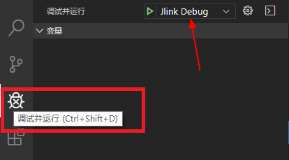

  <h1 align="center">STM32工程示例</h1>

介绍如何使用LiteOS Studio 开发STM32开发板工程。

### 搭建Windows开发环境

#### 安装JLink软件

如果开发板使用`JLink`仿真器，则根据情况安装`JLink`软件。从<a href="https://www.segger.com/downloads/jlink/" target="_blank">`https://www.segger.com/downloads/jlink/`</a>下载，并按安装向导完成安装最新版`JLink`。

建议将`JLink.exe`所在目录加入环境变量。

#### 安装STLink驱动

如果开发板使用`STlink`仿真器，则根据情况安装<a href="https://www.st.com/en/development-tools/stsw-link009.html" target="_blank">`ST-LINK驱动`</a>。

### 工程示例

演示如何新建工程，编译、烧录、串口调试、GDB图形化单步调测等功能。

#### 新建工程

通过菜单`File`中的`New Project`打开新建工程界面。在使用`HUAWEI LiteOS Studio`新建STM32工程时，需要联网，如果需要代理，请提前配置好代理，否则无

法访问`https://gitee.com/`，下载会失败，配置代理方法参考[常见问题](/studio_qa?id=新建工程失败问题)解决。

**步骤 1** 在`工程名称`中填入自定义的工程名

**步骤 2** 在`工程目录`中填入或选择工程存储路径

**步骤 3**  选择SDK版本号，当前STM32工程被维护在`https://gitee.com/`，支持`master`、`LiteOSV200R001C50B039`、`LiteOSV00R001C50B038`三个版本

**步骤 4**  在开发板信息表点选开发板所在行，如`STM32F429IG`、`STM32L431RC`

点击`确认`按钮，后台下载并保存所选目标板的SDK，等待下载完成后会自动重新打开一个LiteOSStudio窗口并自动打开用户新建的工程。

#### 打开工程

新建工程后，会自动打开工程。这里演示如何打开存在的工程：

**步骤 1** 打开LiteOS Studio

**步骤 2** 菜单选择文件File -> 打开文件夹Open Folder，选择工程所在的目录。

#### 工程配置-目标板选择

**步骤 1** 点击工具栏上的工程设置图标，打开工程配置界面。

**步骤 2** 点击`目标板`，选取当前工程对应的开发板，下面以`STM32F429IG`作为示例，点击确认按钮进行保存。

#### 编译配置-编译代码

**步骤 1** 点击工程配置界面上的`编译器`

**步骤 2** `编译器类型`选择`arm-none-eabi`

**步骤 3** `编译器目录`已提供默认路径，也可以点击图标进行自定义设置

**步骤 4** `Make构建器`路径也已提供默认路径，但是也可以点击图标进行自定义设置

**步骤 5** `Makefile脚本`路径需要用户自行填入，对于STM32工程，通常在`targets/开发板名/gcc`路径下的`Makefile`文件上点击右键->设置为Makefile文件，或点击图标

进行自定义设置，也可使用按钮自动搜索脚本文件

**步骤 5** 配置好后点击确认按钮进行保存

**步骤 6** 点击工具栏上的编译图标  进行编译代码，也可以点击清理图标  和重新构建图标  进行清理和重新编译

编译成功的截图示例如下：

清理编译输出的截图示例如下：

#### 烧录配置-烧录

**步骤 1** 点击工程配置界面上的`烧录器`

**步骤 2** `烧录方式`选择`JLink`，如果使用STM32F769、STM32L431工程，选择`STLink/V2`

**步骤 3** `烧录器目录`已提供默认路径，也可以点击图标进行自定义设置

**步骤 4** 点击`烧录文件`后的图标选择编译生成的BIN文件或者使用如下图所示方式选择烧录文件

 

注意：

如果自行下载`JLink`时，指定安装的文件夹不在Studio默认填入的`C:\Program Files (x86)\SEGGER\JLink`下，请在`烧录器目录`重新填写。

如果`STLink/V2`烧录失败时，可能`STLink/V2`驱动未安装，可在官网<a href="https://www.st.com/en/development-tools/stsw-link009.html" target="_blank">`https://www.st.com/en/development-tools/stsw-link009.html`</a>自行安装。

**步骤 5** 配置好后点击进行保存

**步骤 6** 点击工程配置界面上的`串口配置`

**步骤 7** 根据实际情况进行`端口`设置

**步骤 8** 设置`波特率`为`921600`

**步骤 9** 配置好后点击进行保存

**步骤 10** 点击工具栏上的图标进行烧录

烧录成功的截图如下：

**步骤 11** 烧录成功后，选择`查看`-`串口工具`，设置端口，开启串口开关，
开发板按下复位RESET按钮，可以看到串口输出，烧录成功。

#### 调试器-执行调试

LiteOS Studio 调测配置非常简单，只需要几步，即可支持STM32开发板的图形化单步调试。

**步骤 1** 点击工程配置界面上的`调试器`

**步骤 2** `调试器`根据实际情况选择`JLink`、`STLink/V2`或者`OpenOCD`

**步骤 3** `连接方式`根据需求选择`SWD`或`JTAG`, `连接速率`可以默认或者自行指定

**步骤 4** `调试器目录`如果选择了`JLink`，需要指定用户的具体安装目录（默认为`C:\Program Files (x86)\SEGGER\JLink`），如果与实际安装目录不一致，调试可能失败

**步骤 5** `GDB目录`可以默认，或者自行指定

**步骤 6** `调试配置`根据需要，选择`复位调试`或`附加调试`。

***`复位调试`*** 会自动重启开发板，并停止在main函数

***`附加调试`*** 不重启开发板，附加到当前运行代码行

配置好后点击确认按钮进行保存, 会根据用户指定的设置自动生成调测配置。

**步骤 7** 打开调试视图，根据需要，选择调试配置`JLINK Debug`, 点击绿色三角按钮，开始调试。

如果调测器，选择的是`STLink`或者`OpenOCD`，则显示的为`STLink Debug`或`OpenOCD Debug`。

**步骤 8** 调试界面如下：

***变量**     展示本地变量、全局变量、静态变量

***监视**     监视指定的表达式

***调用堆栈** 展示当前的调用堆栈

***断点**     展示设置的断点

***寄存器**     查看各个寄存器的数值，支持复制数值操作

***反汇编 & 内存**     支持对函数进行反汇编，支持查看内存操作。

***输出**     展示`GDB`客户端的输出日志

***调试控制台**     展示`GDB Server`的输出日志

#### 调试器-断点 监视点

在代码行号处单击可以添加断点，或者右键点击，支持`条件断点`、`记录点`等

选中代码文件中的变量或表达式，右键上下文菜单，可以添加监视点：

#### 调试器-寄存器

在`调试面板-寄存器`视图，可查看开发板寄存器的数值。右键可复制寄存器值。

#### 调试器-多线程调测

LiteOS作为轻量级物联网操作系统，同时只能运行一个Task任务线程。在调试时，只能展示当前运行状态的任务线程的调用堆栈。通过多线程感知调测技术，

在调测时，可以展示`Running运行`状态和`Pending暂停`状态的任务线程的调用堆栈，提供更加强大的调试能力。

点击调用堆栈中的栈帧可以跳转到对应的源文件。当在不同任务的栈帧中切换时，`变量`视图会同步更新展示。

#### 调试器-反汇编

在单步调测时，调测面板`反汇编&内存`中，支持查看对应源代码的反汇编代码，支持如下两种方式：

**反汇编指定函数**  通过输入函数名称，展示指定函数的反汇编代码。 

**反汇编当前函数**   自动展示当前任务栈函数的反汇编代码。

反汇编文件展示效果如下：

#### 调试器-查看内存

调测面板`反汇编&内存`中，点击`查看内存`，通过指定内存起始地址及长度，可以展示开发板的内存信息。

### 工程示例-ST-Link仿真器单步调测

对于STM32内嵌ST-Link仿真器的开发板，如`STM23L431RC`、`STM32F769NI`，为了更加稳定的调测体验，建议刷成`JLInk`进行调测。步骤如下：

#### STLinkReflash 刷JLINK固件

确保已安装`ST-LINK USB drivers`和`J-Link`软件。 官方站点下载<a href="https://www.segger.com/downloads/jlink#STLink_Reflash" target="_blank">`ST-Link Reflash Utility`</a>，或<a href="/release/STLinkReflash_190812.zip" target="_blank">本站下载</a>。

**步骤 1** 接受许可Accept

解压`STLinkReflash.zip`, 双击`STLinkReflash.exe`运行，输入`A`接受许可协议。

**步骤 2** Upgrade to J-Link

选择`[1]`, 把开发板板载的ST-Link仿真器刷成J-Link仿真器。

**步骤 3** Restore ST-Link

如果想恢复ST-Link仿真器，可以选择`[3]`执行即可恢复。

#### 工程设置中切换为JLINK

**步骤 1** 烧录器切换为JLINK

**步骤 2** 调试器切换为JLINK

#### 执行调测

正常执行调测，如图：

