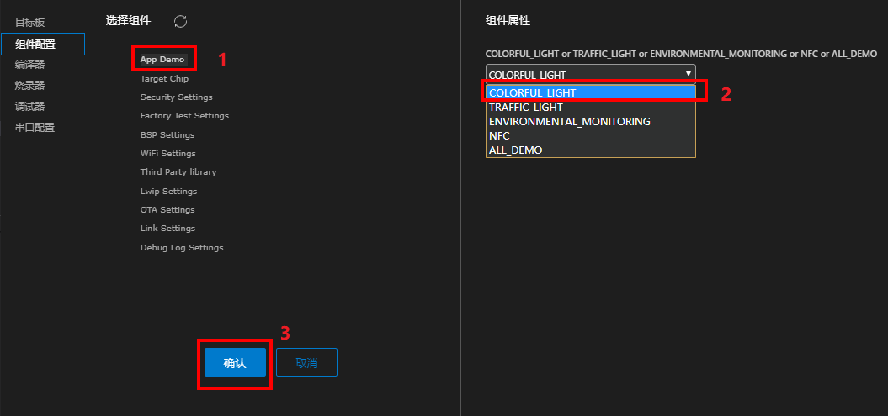
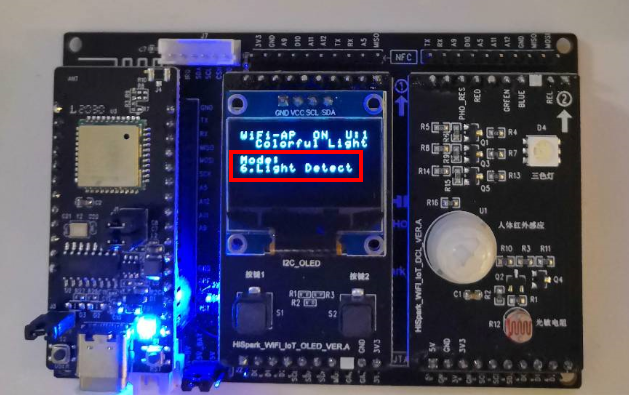
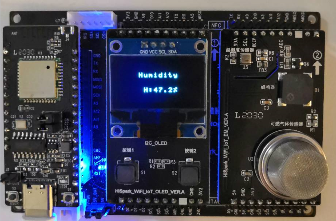
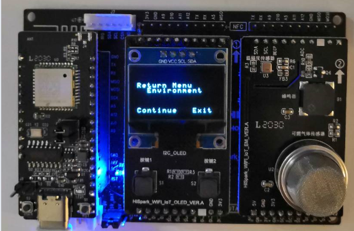
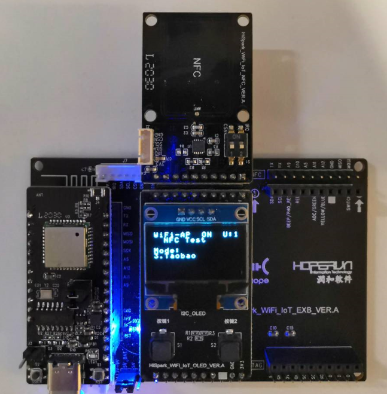

<!-- markdownlint-disable MD033 MD040 MD041 MD024-->
<p align="center">
  <h1 align="center">Hi3861V100 WiFi IoT工程示例</h1>
</p>

本节介绍如何使用`HUAWEI LiteOS Studio`开发WiFi IoT工程。

### 搭建Windows开发环境

`WiFi IoT SDK`使用`Scons`进行构建管理， 需要安装`Python`和`Scons`库， 推荐`Python 3.7`以上版本。

`WiFi IoT SDK`使用`riscv32-unknown-elf`编译器进行编译，使用`JLink`仿真器进行调测。

如果需要新建`WiFi IoT`工程，可能还要安装`git for windows`工具。

#### 安装git for windows工具

参考[安装Git工具](/install?id=安装Git工具)。

#### 安装Python3.7

从<a href="https://www.python.org/downloads/release/python-376/" target="_blank">`https://www.python.org/downloads/release/python-376/`</a>下载， 按照安装向导完成`Python3.7.6`的安装。

安装`Python`时， 勾选 `Add Python x.x to PATH` 选项， 将`Python`的安装根目录， 以及安装根目录下的`Scripts`目录， 加入环境变量。

<font color='red'>注意： 如果是首次安装`python`，建议重启电脑后再进行后续操作，确保`python`环境生效。</font>

#### 安装Scons等三方库

建议使用Pypi镜像提升安装Python三方库的速度，可以使用华为云开源镜像，设置如下：

对于Windows用户，在`C:\Users\<UserName>\pip`目录下添加`pip.ini`文件，如果不存在`pip`目录，需要自己创建。

然后编辑其内容如下:

```
[global]
index-url = https://repo.huaweicloud.com/repository/pypi/simple
trusted-host = repo.huaweicloud.com
timeout = 120
```

最后打开命令行窗口， 执行如下命令安装Python三方库：

```
pip install pycryptodome
pip install ecdsa
pip install pywin32
pip install scons
```

#### 安装riscv32-unknown-elf编译器

如果需要执行编译功能，则应安装`riscv32-unknown-elf`编译器。可联系<a href="https://gitee.com/LiteOS/LiteOS_Studio/issues" target="_blank">`HUAWEI LiteOS Studio`技术支持</a>获取编译器。

#### 安装JLink软件

如果`WiFi IoT`开发板支持使用`JLink`仿真器进行`GDB`调测，开发者对`WiFi IoT`工程进行调测前，需要确保本机已安装`JLink`软件。参考[安装JLink仿真器软件](/install?id=安装JLink仿真器软件)。

#### 获取WiFi IoT SDK

请<a href="https://gitee.com/LiteOS/LiteOS_Studio/issues" target="_blank">联系我们</a>获取 `WiFi IoT SDK`，解压到本地工作目录。

### 使用入门

演示如何新建工程、编译、烧录、串口调试等功能。

#### 新建工程（可选）

**<font color='red'>注意：当本地已有工程/源码时，无需再新建工程，直接进入下一步`打开工程`。</font>**

通过点击`新建工程`图标，打开新建工程界面。

**步骤 1** 在`工程名称`中填入自定义的工程名

**步骤 2** 在`工程目录`中填入或选择工程存储路径

**步骤 3**  选择SDK版本号，当前WiFi IoT工程被维护在[润和 HiHope社区](https://gitee.com/hihopeorg)，版本号为`HiHope WiFi-IoT Hi3861SPC021`

**步骤 4**  在`SDK目录`中填入或选择本地原始SDK路径

**步骤 5**  `工程参考`中可以填入本地路径，也可以填入远程gitee地址。使用远程gitee下载的方式时，需要联网，确保可以访问[润和 HiHope社区](https://gitee.com/hihopeorg)。如果联网需要代理，请提前配置好代理，否则新建工程会失败。配置代理方法参考[常见问题](/studio_qa?id=新建工程失败问题)。同时，需要确保本地已安装`git for windows`工具。

填入远程gitee地址时，需要填入标签或分支的完整地址，例如`https://gitee.com/hihopeorg/HiSpark-WiFi-IoT-DevKit/tree/HiSpark_WiFi-IoT_VER_A_Hi3861_Dev_Kit_SPC021_V1.0.1`（DevKit案例）或`https://gitee.com/hihopeorg/HiSpark-WiFi-IoT-OC/tree/HiSpark_WiFi-IoT_VER_A_Hi3861_OC_Kit_SPC021_V1.0.1`（OC案例）

**步骤 6**  在开发板信息表点选开发板所在行，目前默认提供`Hi3861V100`开发板

点击`确认`按钮后可能会弹出对话框，让填写gitee的账号和密码，提交后，后台会下载并保存所选目标板的SDK，等待下载完成后会在一个新窗口中自动打开带有工程参考的新建工程。


#### 打开工程

新建工程后，会自动打开工程。如果需要打开存在的工程，点击`打开工程`图标，选择`WiFi IoT`工程所在目录即可。

#### 目标板配置-选择目标板

**步骤 1**  点击工具栏上的工程设置图标， 打开工程配置界面

**步骤 2**  点击`目标板`， 选取`Hi3861V100`， 点击确认按钮进行保存


#### 组件配置-组件使能与属性修改

点击工程配置界面上的`组件配置`，在左侧的`选择组件`中点击想要使能或修改的组件，在右侧的`组件属性`栏勾选需要使能的组件，或更改组件属性值，点击确认按钮保存。


#### 编译配置-编译代码

**步骤 1**  点击工程配置界面上的`编译器`


**步骤 2**  `编译器类型`选择`riscv32-unknown-elf`

**步骤 3**  `编译器目录`已提供默认路径， 用户可以将`riscv32-unknown-elf`编译器安装到该路径下，也可以点击图标根据实际情况填入`riscv32-unknown-elf-gcc.exe`所在路径

**步骤 4**  `SConstruct脚本`可以点击图标 或在脚本文件上`单击右键->设置为SConstruct文件`进行自定义设置， 也可使用按钮自动搜索脚本文件

**步骤 5**   配置好后点击确认按钮进行保存

**步骤 6**   点击工具栏上的编译图标  开始编译代码，也可以点击清理图标  和重新构建图标  进行清理和重新编译

编译成功的截图示例如下：


清理编译输出的截图示例如下：


<font color='red'>注意：如果编译报错`Error 309`，参考[常见问题](/studio_qa?id=scons编译报error-309)解决。</font>

#### 烧录配置-HiBurner串口烧录

`WiFi IoT`开发板支持`HiBurner`串口烧录，部分支持`JLink`的开发板也已经支持[JLINK烧录](/project_wifiiot?id=烧录配置-J-LINK烧录)。

**步骤 1**   点击工程配置界面上的`烧录器`


**步骤 2**   `烧录方式`选择`HiBurner`
**<font color='red'>注意：HiBurner烧录方式，需要确保开发板主板右边的4个拨码开关全部往上拨。</font>**

**步骤 3**   `烧录器目录`已提供默认路径， 也可以点击图标进行自定义设置

**步骤 4**   `烧录文件`设置，可以通过手动和自动两种方式设置文件：
- 手动设置：点击`烧录文件`后的图标  浏览选择编译生成的BIN文件，也可以选中要烧录的文件，右键->设置为烧录文件，如下图所示：

   

- 自动设置：点击下拉菜单选择烧录文件

 **<font color='red'>注意：对于HiBurner串口烧录， 支持的烧录文件为`Hi3861_demo_burn.bin`和`Hi3861_demo_allinone.bin`。</font>**

**步骤 5**   `传输模式`只支持串口烧录，使用默认的`Serial`即可

**步骤 6**   配置好后点击进行保存

**步骤 7**   点击工程配置界面上的`串口配置`


**步骤 8**   根据实际情况进行`端口`设置


**步骤 9**   设置`波特率`为`921600`， `数据位`、`停止位`、`奇偶`、`流控`保持默认即可

**步骤 10**   配置好后点击保存

**步骤 11**   点击工具栏上的图标进行烧录

弹出烧录进度框，提示用户复位`RESET`开发板，<font color='red'>注意：HiBurner烧录前需要先把JLink烧录设备从开发板移除，否则无法烧录</font>：


烧录成功的截图如下，点击关闭按钮，关闭烧录弹窗。<font color='red'>注意：如果没有关闭烧录窗口，当再次按下开发板上的复位键时会再次进入烧录过程。</font>


**步骤 12**   烧录成功后，点击`串口终端`图标打开串口终端界面，设置`端口`，开启`串口开关`，开发板按下复位`RESET`按钮，可以看到串口输出， 烧录成功


#### 烧录配置-J-LINK烧录

在使用`J-Link`烧录之前，请确认已经支持该烧录方式，如果不支持，请使用[串口烧录方式](/project_wifiiot?id=烧录配置-HiBurner串口烧录)。

**步骤 1**   点击工程配置界面上的`烧录器`


**步骤 2**   `烧录方式`选择`JLink`
**<font color='red'>注意：JLink烧录方式，需要确保开发板主板右边的4个拨码开关全部往下拨。</font>**

**步骤 3**   `烧录器目录`已提供默认路径，也可以点击图标进行自定义设置

**步骤 4**   `烧录文件`设置，可以通过手动和自动两种方式设置文件：
- 手动设置：点击`烧录文件`后的图标  浏览选择编译生成的BIN文件，也可以选中要烧录的文件，右键->设置为烧录文件，如下图所示：

   

- 自动设置：在编译过程中会自动识别出编译输出件`bin`、`hex`、`fwpkg`并填入`烧录文件`下拉菜单中，可以点击下拉菜单选择烧录文件，如下图所示：

    

 **<font color='red'>注意：对于J-LINK烧录，仅支持`Hi3861_demo_burn.bin`烧录文件，不支持使用`Hi3861_demo_allinone.bin`。</font>**

**步骤 5**   `连接方式`、`连接速率`、`加载地址`使用默认值

`连接方式`当前只支持`JTAG`， `连接速率`使用默认值`2000KHz`， 否则烧录会失败。对于`WiFi IoT`开发板， `加载地址`为`0x400000`。

**步骤 6**   配置好后点击保存

**步骤 7**   点击工具栏上的图标进行烧录

在`终端`窗口会输出烧录进度，烧录成功的截图如下：


#### 调试器-执行调试

`HUAWEI LiteOS Studio` 调测配置非常简单，只需要几步，即可支持`WiFi-IoT` 图形化单步调试。由于`WiFi IoT`的`ROM`、封库特性，有些源码无法单步调测。对于没有对应源代码的文件，可以使用反汇编文件进行展示。

**步骤 1**   点击工程配置界面上的`调试器`


**步骤 2**   `调试器`选择`JLink`

**步骤 3**   `连接方式`选择`JTAG`，**<font color='red'>注意: 对于`WiFi IoT` 开发板的连接方式一定要选择`JTAG`。</font>**`连接速率`可以默认或者自行指定

**步骤 4**   `调试器目录`选择`JLink`的安装目录

**步骤 5**   `GDB目录`可以默认或者自行指定

**步骤 6**   `可执行文件路径`选择输出目录下的`.out`文件，编译后可以从下拉菜单点选，或者自行指定

**步骤 7**   `调试配置`根据需要选择`复位调试`或`附加调试`

- 复位调试 会自动重启开发板，并停止在main函数

- 附加调试 不重启开发板，附加到当前运行代码行

配置好后点击确认按钮保存

**步骤 8**   在`HUAWEI LiteOS Studio`左侧的活动栏点击`运行`视图，可以看到默认已经配置好调试配置`Jlink Debug`，点击绿色三角按钮开始调试


**步骤 9**   调试界面如下：


- **变量**           展示局部变量、全局变量、静态变量

- **监视**           监视指定的表达式

- **调用堆栈**       展示当前运行状态和暂停状态的任务调用堆栈

- **断点**           展示设置的断点

- **寄存器**         查看各个寄存器的数值，支持复制数值操作

- **反汇编 & 内存**  支持对函数进行反汇编，支持查看内存操作

- **输出**           展示`GDB`客户端的输出日志

- **调试控制台**     展示`GDB Server`的输出日志

#### 调试器-断点

添加断点有两种方式：
- 方式一：将鼠标放在代码行号处，行号前面会出现红色圆点，单击圆点将这一行添加为断点。
- 方式二：点击右键`添加断点`、`添加条件断点`、`添加记录点`。

   

右键可以对添加的断点做删除、编辑、禁用操作。

#### 调试器-监视点
选中代码文件中的变量或表达式，点击右键添加监视点：


#### 调试器-寄存器

在`调试面板-寄存器`视图，可查看开发板各寄存器的数值。点击右边的“copy value”可以复制这个数值。


#### 调试器-多线程调测

LiteOS作为轻量级物联网操作系统，同时只能运行一个Task任务线程，调试时只能展示当前运行状态的任务线程的调用堆栈。通过多线程感知调测技术，调测时可以展示`Running运行`状态和`Pending暂停`状态的任务线程的调用堆栈，提供更加强大的调试能力。


点击调用堆栈中的栈帧可以跳转到对应的源文件。当在不同任务的栈帧中切换时，`变量`视图也会同步更新展示。

#### 调试器-反汇编

单步调测时，在`调试面板-反汇编&内存`视图中，可以查看对应源代码的反汇编代码，支持如下两种方式：


- **反汇编指定函数**  点击反汇编指定函数，在弹出的窗口中输入想要反汇编的函数名，回车后就可以在代码区中看到这个函数的反汇编代码。

   

- **反汇编当前函数**  点击反汇编当前函数，就可以在代码区中展示当前函数的反汇编代码。

反汇编文件展示效果如下：


#### 调试器-查看内存

在`调试面板-反汇编&内存`视图中，点击`查看内存`，在弹窗中输入内存起始地址及长度，可以展示开发板的内存信息。


查看内存展示效果如下：


### 炫彩灯工程案例

演示如何新建/打开工程， 编译、烧录、效果演示等功能。

#### 硬件准备

硬件准备指的是`WiFi IoT`开发板的准备。本案例涉及到主板、通用底板、OLED屏和炫彩灯单板。

- **Hi3861V100主板:**

  

- **通用底板:**

  

- **炫彩灯单板:**

  炫彩灯单板主要包括三部分：
  - 炫彩三色灯：由红绿蓝三种颜色组成，通过PWM来驱动，可以通过调节RGB的比例来呈现出不同的颜色。通过调节占空比来调节灯的亮度。
  - 人体红外传感器：通过红外探头发出的红外信号来检测外部环境的人体活动情况。
  - 光敏电阻：主要用于检测外部环境的光照情况。

    

开发板的安装：将Hi3861主板、OLED屏、炫彩灯板插到底板上，下图所示为**主板、OLED屏和炫彩灯单板的组合:**


#### 新建/打开工程

参考[新建工程](/project_wifiiot?id=新建工程（可选）)或[打开工程](/project_wifiiot?id=打开工程)。

SDK路径示例如下（注意：下面截图路径为参考路径，应以用户实际路径为准）：


**SDK文件结构：**

- app：
存放demo示例文件
- boot:
包含 commonboot/flashboot/loadboot，包含3861的drivers/startup等
- build:
编译配置
- components:
Hi3861组件， 如wifi/histreaming/at/hilink/mcast6等
- config:
系统配置
- documents:
Hi3861的开发指南等
- include:
Hi3861包含的头文件
- output:
编译后输出的编译文件bin
- platform:
包含Hi3861的外设驱动， 如i2c/spi/uart；cpu的内核core
- third_party:
第三方应用， 如mqtt/cjson/coap等
- tool:
配置工具， 如python脚本/xml文件等

#### 目标板配置

工程配置中需要设置`WiFi IoT`开发板，参考[选择目标板](/project_wifiiot?id=目标板配置-选择目标板)。

#### 组件配置

**步骤 1**   点击工程配置界面上的`组件配置`:



**步骤 2**   选择`App Demo`->选择`COLORFUL_LIGHT`，点击确认按钮保存，这样就选择了炫彩灯的demo。

#### 编译配置及编译代码

参考[编译配置-编译代码](/project_wifiiot?id=编译配置-编译代码)。

#### 烧录配置及开发板烧录

`WiFi IoT`开发板支持HiBurner串口烧录，支持JLINK的开发板也已经支持JLINK烧录。可分别参考[Hiburner串口烧录](/project_wifiiot?id=烧录配置-hiburner串口烧录)和[J-Link烧录](/project_wifiiot?id=烧录配置-j-link烧录)。

#### 案例效果演示

炫彩灯Demo一共有7种模式：

**1、Control Mode:**  初始模式主要是三色灯的控制，每按一次右键S2，就会在红、绿、蓝三个状态之间切换。如初始状态是红灯亮，按下右键S2就会让绿灯亮，再按一下蓝灯亮，再按又是红灯亮，如此循环。


解释一下OLED屏上显示的其中四行文字分别代表的含义：

- 第一行：`WiFi-AP ON U:1` WiFi状态`ON`表示WiFi的`AP`状态开启，`OFF`表示WiFi的`AP`状态关闭，U表示有几台设备与主板建立连接。`WiFi-Client ON/OFF C/D`显示是否接入路由器，`C/D`：Connect/Disconnect。

- 第二行：`Colorful Light`表示现在演示的是哪一个demo，当前为炫彩灯。

- 第四行：`Control Mode`表示现在是在哪个模式下(模式控制)。

- 第六行：`Red on`表示现在是哪种状态(红灯亮)。

**2、Colorful Light:** 在上节`Control Mode`的状态下，按下左键S1，就从`Control Mode`跳到了`Colorful Light`。每按一次右键S2，三色灯就会按照不同时间间隔进行循环亮灭。

- 1.period 1s：红、绿、蓝三色灯每隔1秒轮流亮一次。

- 2.period 0.5s：红、绿、蓝三色灯每隔0.5秒轮流亮一次。

- 3.period 0.25s：红、绿、蓝三色灯每隔0.25秒轮流亮一次。


**3、PWM Control:** 在上节`Colorful Light`的状态下，再按下左键S1，就从`Colorful Light`跳到了`PWM Control`模式，每按一下右键S2，就会实现不同的调光类型。

- 1.Red：红色由暗到最亮

- 2.Green：绿灯由暗到最亮

- 3.Blue：蓝灯由暗到最亮

- 4.Purple：紫灯由暗到最亮

- 5.All：白灯由暗到全亮


**4、Brightness：** 再次按下左键S1，就会从`PWM Control`跳到`Brightness`模式，每按下右键S2，三色灯的亮度就会发生变化，在较暗、中等亮度、最亮三种状态间循环变化。

- 1.low：较暗亮度

- 2.middle：中等亮度

- 3.high：最亮状态


**5、Human Detect:** 再次按下左键S1，会从`Brightness`模式跳到`Human detect`，该模式通过红外探头发出的红外信号来检测外部环境的人体活动情况。当有人经过，白灯会亮起;当人离开，白灯会熄灭。可以通过人的靠近和远离来进行测试。


**6、Light Detect:** 再次按下左键S1，会从`Human detect`跳到`Light Detect`，光敏电阻主要用于检测外部环境的光照情况。如果检测到有光源，灯熄灭；当检测到无光源，灯亮起。可以用手遮住光敏电阻或拿开来测试。



**7、Union Detect:** 当再次按下左键S1时，就会从`Light Detect`跳到`Union detect`，主要是将人体红外传感器和光敏电阻结合起来，控制白灯的亮灭。当在无光源环境下且有人经过时，灯会亮起，其他情况下灯都是熄灭状态。可把光敏电阻遮住，通过人的走近和远离来测试现象。


**8、Return Menu:** 炫彩灯的所有模式都已经展示完毕。当再次按下左键S1，会出现如下图所示的情况，此时按左键S1就执行continue， 继续演示炫彩灯的各种模式。


### 交通灯工程案例

演示如何新建/打开工程， 编译、烧录、效果演示等功能。

#### 硬件准备

硬件准备指的是`WiFi IoT`开发板的准备。本案例涉及到主板、通用底板、OLED屏和交通灯单板。主板、底板的介绍可参考[炫彩灯工程案例-硬件准备](/project_wifiiot?id=硬件准备)。

安装`WiFi IoT`开发板及交通灯demo所需的板子——交通灯单板，将交通灯单板安插在底板的最右侧。

**交通灯单板：** 主要包括三部分：
- 交通灯，由红绿蓝三种颜色组成，通过PWM驱动。可以通过调节RGB的比例来呈现出不同的颜色，通过调节占空比来调节灯的亮度。
- 人体红外传感器，通过红外探头发出的红外信号来检测外部环境的人体活动情况。
- 光敏电阻，主要用于检测外部环境的光照情况。此模块和炫彩灯一样有防呆的箭头和标号。

 


#### 新建/打开工程

参考[新建工程](/project_wifiiot?id=新建工程（可选）)或[打开工程](/project_wifiiot?id=打开工程)。

#### 工程配置

工程配置包括：
- 目标板配置，设置`WiFi IoT`开发板，参考[选择目标板](/project_wifiiot?id=目标板配置-选择目标板)。
- 组件配置，按照下图中的步骤配置即可。

  
- 编译配置及编译代码，参考[编译配置-编译代码](/project_wifiiot?id=编译配置-编译代码)。
- 烧录配置及开发板烧录，参考[炫彩灯工程案例-烧录配置及开发板烧录](/project_wifiiot?id=烧录配置及开发板烧录)。

#### 案例效果演示

交通灯demo一共有3种模式：

**1、Control Mode：** 此demo的初始状态是`Control Mode`，可以通过右键S2控制红、黄、绿灯的亮灭状态。绿灯亮时，蜂鸣器会长周期响，红灯或绿灯亮时则是短周期响。


**2、Auto Mode：** 按下左键S1，会从`control mode`跳到`Auto mode`。此模式模仿交通灯，红灯常亮5秒后闪烁3秒，接着黄灯闪烁3秒，然后绿灯常亮5秒后闪烁3秒，如此循环。绿灯亮时蜂鸣器长周期响，红灯或黄灯亮时短周期响。最后一行的`R`、`Y`、`G`后面的数字代表亮灯时间的倒计时，动态显示，单位是秒。`R`代表红灯，`Y`代表黄灯，`G`代表绿灯。`B`代表蜂鸣器，`1`代表蜂鸣器打开状态， `0`代表蜂鸣器关闭状态。交通灯亮灯时间的倒计时也可以在代码中自行设置。


**3、Human Mode：** 再次按下左键S1，会从`Auto mode`跳到`Human Mode`模式。该模式在`Auto mode`的基础上增加了人为控制，且红灯常亮**改为30秒**。模仿交通灯，红灯常亮30秒后闪烁3秒，接着黄灯闪烁3秒，然后绿灯常亮5秒后闪烁3秒，如此循环。一旦按下右键S2，红灯立即快闪3秒后绿灯常亮5秒，绿灯闪烁3秒后再进入红灯30秒常亮模式，后进入正常循环。绿灯亮时蜂鸣器长周期响，红灯或黄灯亮时短周期响。此时再按一下左键S1就会跳到`Return Menu`界面，选择按下`Continue`继续demo循环。


### 环境监测工程示例

演示如何新建/打开工程， 编译、烧录、效果演示等功能。

#### 硬件准备

硬件准备指的是`WiFi IoT`开发板的准备。本案例涉及到主板、通用底板、OLED屏和和环境监测单板。主板、底板的介绍可参考[炫彩灯工程案例-硬件准备](/project_wifiiot?id=硬件准备)。

安装`WiFi IoT`开发板及环境监测demo所需的板子——环境监测单板，将环境监测单板安插在底板的最右侧。

**环境监测单板：** 主要包括三部分：
- 温湿度传感器，主要用于检测外部环境的温湿度数据。
- 可燃气体检测传感器，主要用于检测外部环境的液化气、苯、酒精、烟雾等气体的浓度。
- 蜂鸣器，通过设定温湿度传感器和可燃气体检测传感器采集数据的阈值，当数据超过阈值蜂鸣器发出警报。


#### 新建/打开工程

参考[新建工程](/project_wifiiot?id=新建工程（可选）)或[打开工程](/project_wifiiot?id=打开工程)。

#### 工程配置

工程配置包括：
- 目标板配置，设置`WiFi IoT`开发板，参考[选择目标板](/project_wifiiot?id=目标板配置-选择目标板)。
- 组件配置，按照下图中的步骤配置即可。

  
- 编译配置及编译代码，参考[编译配置-编译代码](/project_wifiiot?id=编译配置-编译代码)。
- 烧录配置及开发板烧录，参考[炫彩灯工程案例-烧录配置及开发板烧录](/project_wifiiot?id=烧录配置及开发板烧录)。

#### 案例效果演示

环境监测demo共有4种模式：

**1、Environment Monitoring：** 此demo的初始状态是`Environment Monitoring`，主要用来实时显示外部环境的温湿度以及可燃气体的浓度。OLED显示屏最后一行的文字含义如下：

T：Temperature温度， H：Humidity湿度， CG：Combustible Gas可燃气体

当温度超过25度，蜂鸣器长周期响；超过30度，短周期响。这里的温度阈值也可以在代码中自行设置。


**2、Temperature Mode：** 按下左键S1，会从`Environment Monitoring`模式跳到`Temperature Mode`模式，此模式下OLED屏上只显示实时温度，通过温湿度传感器来实时监测外界环境的温度数据。


**3、Humidity Mode：** 再次按下左键S1，会从`Temperature Mode`模式跳转到`Humidity mode`模式，此模式下的OLED屏上只显示实时的湿度，通过温湿度传感器来实时监测外界环境的湿度数据。



**4、Combustible Gas Mode：** 再次按下左键S1，会从`Humidity mode`模式跳转到`Combustible Gas Mode`模式，此模式下的OLED屏上只显示实时可燃气体浓度数据，通过可燃气体传感器来实时监测外界环境的可燃气体浓度数据。此时如果再按一下左键S1就会跳到`Return Menu`界面，选择Exit就可以跳转到主菜单选择界面。




### NFC工程案例

演示如何新建/打开工程， 编译、烧录、效果演示等功能。

#### 硬件准备

硬件准备指的是`WiFi IoT`开发板的准备。本案例涉及到主板、通用底板、OLED屏和和NFC单板。主板、底板的介绍可参考[炫彩灯工程案例-硬件准备](/project_wifiiot?id=硬件准备)。

NFC demo所需的板子——NFC单板如下图所示：


NFC demo可以唤起5个应用程序：微信/今日头条/淘宝/华为智慧生活/histreaming，通过按钮进行切换即可。

安装好后的`WiFi IoT`开发板及NFC单板如下图所示：


#### 新建/打开工程

参考[新建工程](/project_wifiiot?id=新建工程（可选）)或[打开工程](/project_wifiiot?id=打开工程)。

#### 工程配置

工程配置包括：
- 目标板配置，设置`WiFi IoT`开发板，参考[选择目标板](/project_wifiiot?id=目标板配置-选择目标板)。
- 组件配置，按照下图中的步骤配置即可。
  
- 编译配置及编译代码，参考[编译配置-编译代码](/project_wifiiot?id=编译配置-编译代码)。
- 烧录配置及开发板烧录，参考[炫彩灯工程案例-烧录配置及开发板烧录](/project_wifiiot?id=烧录配置及开发板烧录)。

#### 案例效果演示

NFC demo会拉起5个APP，按键切换可以拉起不同应用。

**1、Wechat：** NFC demo初始状态是WeChat。在这种模式下用安卓手机碰一下NFC板，就会调起手机的微信APP。


**2、Today Headline：** 按下左键S1，会从`WeChat mode`跳到`Today Headline mode`，用安卓手机碰一下NFC板，就会调起手机的今日头条APP。


**3、Taobao：** 再按下左键S1，会从`Today Headline mode`跳到`Taobao mode`，用安卓手机碰一下NFC板，就会调起手机的淘宝APP。



**4、Huawei_SM_life：** 再按下左键S1，会从`Taobao mode`跳到`Huawei SM_Life mode`，用安卓手机碰一下NFC板，就会调起手机的华为智慧生活APP。


**5、Histreaming：** 再按下左键S1，会从`Huawei SM_Life mode`跳到`Histreaming mode`，用安卓手机碰一下NFC板，就会调起手机的Histreaming APP。

`Histreaming APP`是我们自己开发的一款手机APP，主要是通过WiFi与主板建立通信，如果把主板安装在智能小车上面，可以通过Histreaming来控制小车的运动，比如前进后退、左右移动、红外循迹、智能避障等功能，后续会结合芯片开发更多的功能，敬请期待。


### All Demo 工程示例

演示如何新建/打开工程， 编译、烧录、效果演示等功能。

#### 硬件准备

准备好单板，可以参考以上各案例。

#### 新建/打开工程

参考[新建工程](/project_wifiiot?id=新建工程（可选）)或[打开工程](/project_wifiiot?id=打开工程)。

#### 工程配置

工程配置包括：
- 目标板配置，设置`WiFi IoT`开发板，参考[选择目标板](/project_wifiiot?id=目标板配置-选择目标板)。
- 组件配置，按照下图中的步骤配置即可。 
  
- 编译配置及编译代码，参考[编译配置-编译代码](/project_wifiiot?id=编译配置-编译代码)。
- 烧录配置及开发板烧录，参考[炫彩灯工程案例-烧录配置及开发板烧录](/project_wifiiot?id=烧录配置及开发板烧录)。

#### 案例效果演示

上电时先显示“Hello Hi3861”表示主板`Hi3861`启动成功


然后进入如下界面：


此时我们就可以通过按键S1和S2来对OLED屏板进行控制了。

屏幕上面的4行文字分别对应了：
- 1.炫彩灯demo
- 2.交通灯demo
- 3.环境监测demo
- 4.NFC碰一碰demo

最后一行`Select：`后面的数字对应了我们选择的demo序号，通过左键S1来选择，Enter是确认按键，由右键S2来控制。例如现在要演示第2个demo，先按左键S1，让`select：`后面的数字显示为2，再按右键S2进行Enter确认，进入第2个demo的演示界面。


#### Histreaming APP控制设备侧

**步骤 1** 组件配置

打开LiteOS Studio的`工程配置-组件配置`，依次选择`Link Settings`->`Histreaming support`->`确认`，如下图所示：


**步骤 2** 重新编译，烧录重启后，串口打印如下：


**步骤 3** 打开手机WiFi查看Hi3861发出的热点，点击连接即可


**步骤 4** 获取Histreaming APP。扫描下方二维码即可下载（当前APP只支持安卓系统，不支持IOS系统）


**步骤 5** 打开Histreaming APP，出现这个界面时，往下滑动刷新


直到出现如下界面，点击`局域网`


显示界面如下，其中`Colorful_Light`、`Traffic_Light`、`Environment`、`NFC`这四个界面是HiSpark的Demo


选择`Colorful_light`，可以操作`Colorful_light`(炫彩灯Demo)下的任意一个module。如果想切换到`Traffic_light`（交通灯Demo），必须先退出当前Demo，点击`Return_Menu_Module`，才能选择其他Demo。每个Demo界面下都有一个`Return_Menu_Module`。

注意：点击`Return_Menu_Module`是告诉设备侧，已经退出当前Demo，可以进入其他Demo模式了，在没有退出当前Demo模式之前，不能跨Demo模式执行。


#### Ocean Connect连接华为云属性上报

**华为云网站操作**

**步骤 1** 注册华为云账号：

打开华为云网址，点击注册后登陆。

**步骤 2** 登陆后在搜索框中输入`IOTDA`，在弹出选项中选择`设备接入IOTDA`。


**步骤 3** 创建产品（产品名称可自定义）：


**步骤 4** 创建属性（注意属性必须和设备侧上报的一致）：


**设备侧操作**

**步骤 1** 组件配置

在LiteOS Studio的`工程配置-组件配置`中依次选择`Link Settings`->`Ocean Connect support`->`确认`。


**步骤 2** 在代码中设置热点SSID和密码后编译、烧录

**步骤 3** 手机上设置热点SSID和密码（需要和代码中的SSID、密码一致）

**步骤 4** 复位重启开发板。开发板重启后，程序会自动扫描当前网络中存在的WiFi热点SSID，等待连接热点的串口打印如下：


日志中打印`WiFi: Connected`，表示WiFi已经连接成功：


设备侧属性上报，下图是炫彩灯上报成功的设备侧日志输出：


**华为云网站查看属性**

打开华为云网页，即可看到设备已在线：


点击进入，即可看到上报的属性。下图上报的是环境监测案例在具体模式下的温度（单位：°C）、湿度（单位：百分比）、可燃气体值（单位：PPM）：


**手机上APP操作**

通过`Hi3861 Demo APP`可以在云端控制设备侧，并上报属性。

**步骤 1** 获取`Hi3861 Demo APP`，扫描下方二维码即可下载（当前APP只支持安卓系统，不支持IOS系统）


**步骤 2** 打开Hi3861 Demo APP，点击“设置”，进入设置页面


**步骤 3** 在设置页面中设置`IAM用户名`、`IAM用户密码`、`用户所属账号的名称`、`项目ID（必选）`


**步骤 4** 设置好上述的信息后，返回主界面，点击“应用侧”，如下图所示


**步骤 5** 点击“V5应用接入”，进入的`应用鉴权`页面


**步骤 6** 在`应用鉴权`页面，先点击`读取设置`查看之前设置的情况，再点击`应用鉴权`，如果在`操作日志`框中显示“鉴权成功”，说明已经成功设置信息`IAM用户名`、`IAM用户密码`等信息


**步骤 7** 返回主界面，点击`最佳实践`：


**步骤 8** 进入`最佳实践`的页面后，点击`查询设备`后再点击`设备控制`


**步骤 9** 进入`设备控制`后即可控制设备。至此，APP的相关操作已经结束

