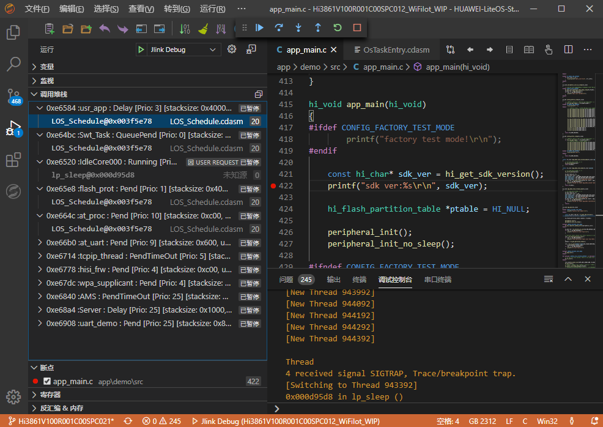
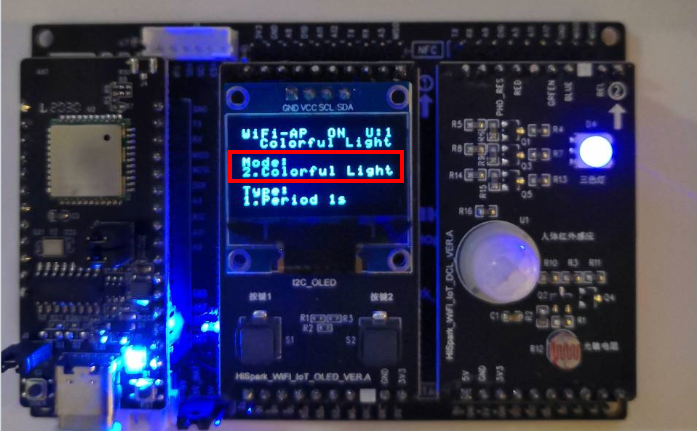
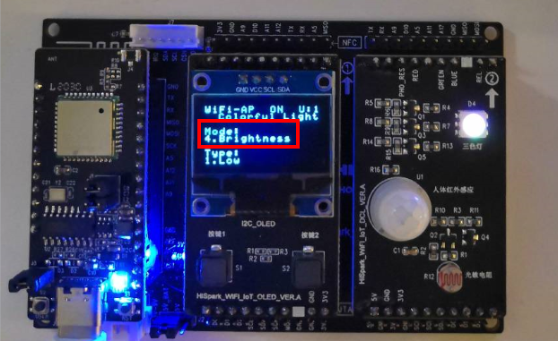

<p align="center">
  <h1 align="center">Hi3861V100 WiFi IoT工程示例</h1>
</p>

介绍如何使用LiteOS Studio 开发WiFi IoT工程。

### 搭建Windows开发环境

`WiFi IoT SDK`使用Scons进行构建管理，需要安装`Python`和`Scons`库。

#### 安装Python3.7   

从<a href="https://www.python.org/downloads/release/python-376/" target="_blank">`https://www.python.org/downloads/release/python-376/`</a>下载，并按安装向导完成安装Python3.7.6。
	
需要将Python安装根目录，如`C:\Python37`，以及安装根目录下Scripts目录，如`C:\Python37\Scripts`，加入环境变量。
   
#### 安装Scons等三方库

建议使用Pypi镜像提升安装Python三方库的速度，可以使用华为云开源镜像，设置如下：

对于Windows用户，在`C:\Users\<UserName>\pip`目录下添加`pip.ini`文件，如果不存在`pip`目录，需要自己创建。

然后编辑其内容如下:

```
[global]
index-url = https://repo.huaweicloud.com/repository/pypi/simple
trusted-host = repo.huaweicloud.com
timeout = 120
```

然后打开命令行窗口，执行如下命令安装Python三方库：

```
pip install pycryptodome
pip install ecdsa
pip install pywin32
pip install scons
```

#### 获取WiFi IoT 等SDK(可选)

新建WiFi IoT工程时，会自动连接服务器下载`WiFi IoT SDK`，当前服务器只部署在华为黄区内网。如果不能访问服务器，可以联系技术支持，把SDK提前下载好。

### 使用入门

演示如何新建工程，编译、烧录、串口调试等功能。

#### 新建工程
通过菜单`File`中的`New Project`打开新建工程界面。

**步骤 1**	在`工程名称`中填入自定义的工程名

**步骤 2**	在`工程目录`中填入或选择工程存储路径

**步骤 3** 选择SDK版本号，目前WiFi IoT的SDK支持`Hi3861V100R001C00SPC021`版本

**步骤 4** 在开发版信息表点选`Hi3861V100`开发板所在行

点击`确认`按钮，后台下载并保存所选目标板的SDK，等待下载完成后会自动重新打开一个LiteOSStudio窗口并自动打开用户新建的工程。


#### 打开工程

新建工程后，会自动打开工程。这里演示如何打开存在的工程：

**步骤 1**	打开LiteOS Studio； 
 

**步骤 2**	菜单选择`文件File -> 打开文件夹Open Folder`，选择`WiFi IoT` 工程所在的目录。

#### 工程配置-目标板选择

**步骤 1**	点击工具栏上的工程设置图标，打开工程配置界面。

**步骤 2**	点击`目标板`，选取`Hi3861V100`，点击确认按钮进行保存。


#### 编译配置-编译代码

**步骤 1**	点击工程配置界面上的`编译器`


 
**步骤 2**	`编译器类型`选择`riscv32-unknown-elf`

**步骤 3**	`编译器目录`已提供默认路径，也可以点击图标进行自定义设置

**步骤 4**	`SConstruct脚本`可以点击图标 或在脚本文件上`单击右键->设置为MakeFile/SConstruct文件`进行自定义设置，也可使用按钮自

动搜索脚本文件

**步骤 5**	配置好后点击确认按钮进行保存

**步骤 6**	点击工具栏上的编译图标  进行编译代码，也可以点击清理图标  和重新构建图标  进行清理和重新编译

编译成功的截图示例如下：


清理编译输出的截图示例如下：


注意：

如果编译报错`Error 309`，参考[常见问题](/studio_qa?id=scons编译报error-309)解决。

#### 烧录配置-HiBurner串口烧录
`WiFi IoT`开发板支持`HiBurner`串口烧录, 支持JLINK的部分开发板也已经支持[JLINK烧录](/project_wifiiot?id=烧录配置-J-LINK烧录)。

**步骤 1**	点击工程配置界面上的`烧录器`


 
**步骤 2**	`烧录方式`选择`HiBurner`

**步骤 3**	`烧录器目录`已提供默认路径，也可以点击图标进行自定义设置

**步骤 4**	点击`烧录文件`后的图标选择编译生成的BIN文件或者使用如下图所示方式选择烧录文件

 
 
**步骤 5**	配置好后点击进行保存

**步骤 6**	点击工程配置界面上的`串口配置`


 
**步骤 7**	根据实际情况进行`端口`设置


 
**步骤 8**	设置`波特率`为`921600`

**步骤 9**	配置好后点击进行保存. <font color='red'> （注意：使用HiBurner烧录方式时，确保先把JLINK烧录设备从开发板移除，否则无法烧录） </font>

**步骤 10**	点击工具栏上的图标进行烧录

弹出烧录进度框，提示用户复位RESET开发板：


 
烧录成功的截图如下，点击关闭按钮，关闭烧录弹窗。


 
**步骤 11**	烧录成功后，选择`查看`-`串口工具`，设置端口，开启串口开关，
开发板按下复位RESET按钮，可以看到串口输出，烧录成功。


#### 烧录配置-J-LINK烧录

在使用J-Link烧录之前，请确认已经支持该烧录方式，如果不支持，请使用[串口烧录方式](/project_wifiiot?id=烧录配置-HiBurner串口烧录)。


**步骤 1**	点击工程配置界面上的`烧录器`


 
**步骤 2**	`烧录方式`选择`JLink`

**步骤 3**	`烧录器目录`已提供默认路径，也可以点击图标进行自定义设置

**步骤 4**	点击`烧录文件`后的图标  浏览选择编译生成的BIN文件，也可以使用如下图所示方式选择烧录文件：

 

在编译过程中会自动识别出编译输出件`bin、hex、fwpkg`，在`烧录文件`下拉选择框，可以选择烧录文件：

 

**步骤 5**	`连接方式`、`连接速率`、`加载地址`使用默认值
    `连接方式`当前只支持`JTAG`, `连接速率`使用默认值`2000KHz`, 否则烧录会失败。

    对于`WiFi IoT`开发板, `加载地址`为`0x400000`。
 
**步骤 6**	配置好后点击进行保存

**步骤 7**	点击工具栏上的图标进行烧录

在`终端`窗口输出烧录进度，烧录成功的截图如下：


 

#### 组件化配置-组件下载与使能

注意：当前版本用户本地的`WIFI IoT`工程中已默认添加`HiStreaming`组件，不需要点击刷新按钮更新在线组件，否则可能导致旧版本`HiStreaming`覆盖当前`HiStreaming`文件

**步骤 1**	点击工具栏上的工程设置图标，打开工程配置界面。

**步骤 2**	点击`组件配置`，在组件属性栏勾选需要使能的组件，或更改组件属性值，点击确认按钮进行保存。


#### HiStreaming组件演示

**步骤 1**	在组件管理页面选择`Histreaming Support`, 另外需要选择`COAP support`，默认`Histreaming Support`和`COAP support`配置项都已打开，如下图，点击确认按钮保存。


**步骤 2**	编译代码，编译成功后执行烧录

**步骤 3**	在串口工具中，连接串口，复位开发板，串口控制台输出信息显示集成histreaming包成功


**步骤 4**	在手机上安装<a href="http://liteos.rnd.huawei.com:8080/liteos_download/release/HiSteaming.apk" target="_blank">`HiSteaming.apk`</a>，添加WiFi IoT设备

**步骤 5**	可以通过App控制WiFi IoT点亮、熄灭LED灯


#### 调试器-执行调试

LiteOS Studio 调测配置非常简单，只需要几步，即可支持`WiFi-IoT` 图形化单步调试。由于`WiFi IoT`的`ROM`、封库特性，有些源码无法单步调测，

对于没有对应源代码的文件，使用反汇编文件进行展示。

**步骤 1**	点击工程配置界面上的`调试器`


 
**步骤 2**	`调试器`选择`JLink`

**步骤 3**	`连接方式`选择`JTAG`, 注意: 对于WiFi IoT 的开发板连接方式一点要选择`JTAG`, `连接速率`可以默认或者自行指定

**步骤 4**	`调试器目录`选择`JLink`的安装目录

**步骤 5**	`GDB目录`可以默认，或者自行指定

**步骤 6**	`可执行文件路径`选择输出目录下的`.out`文件，可在编译后从下拉菜单点选，或者自行指定。

**步骤 7**	`调试配置`根据需要，选择`复位调试`或`附加调试`。

***`复位调试`*** 会自动重启开发板，并停止在main函数

***`附加调试`*** 不重启开发板，附加到当前运行代码行

配置好后点击确认按钮进行保存

**步骤 7**	打开调试视图，可以看到默认已经配置好调试配置`Jlink Debug`, 点击绿色三角按钮，开始调试


**步骤 8**	调试界面如下：


***变量**     展示本地变量、全局变量、静态变量

***监视**     监视指定的表达式

***调用堆栈** 展示当前的调用堆栈

***断点**     展示设置的断点

***寄存器**     查看各个寄存器的数值，支持复制数值操作

***反汇编 & 内存**     支持对函数进行反汇编，支持查看内存操作。

***输出**     展示`GDB`客户端的输出日志

***调试控制台**     展示`GDB Server`的输出日志

#### 调试器-断点 监视点

在代码行号处单击可以添加断点，或者右键点击，支持`条件断点`、`记录点`等


选中代码文件中的变量或表达式，右键上下文菜单，可以添加监视点：


#### 调试器-寄存器

在`调试面板-寄存器`视图，可查看开发板寄存器的数值。右键可复制寄存器值。


#### 调试器-多线程调测

LiteOS作为轻量级物联网操作系统，同时只能运行一个Task任务线程。在调试时，只能展示当前运行状态的任务线程的调用堆栈。通过多线程感知调测技术，

在调测时，可以展示`Running运行`状态和`Pending暂停`状态的任务线程的调用堆栈，提供更加强大的调试能力。



点击调用堆栈中的栈帧可以跳转到对应的源文件。当在不同任务的栈帧中切换时，`变量`视图会同步更新展示。

#### 调试器-反汇编

在单步调测时，调测面板`反汇编&内存`中，支持查看对应源代码的反汇编代码，支持如下两种方式：


**反汇编指定函数**  通过输入函数名称，展示指定函数的反汇编代码。 


**反汇编当前函数**   自动展示当前任务栈函数的反汇编代码。

反汇编文件展示效果如下：


#### 调试器-查看内存

调测面板`反汇编&内存`中，点击`查看内存`，通过指定内存起始地址及长度，可以展示开发板的内存信息。


### 炫彩灯工程案例

演示如何创建/打开工程，编译、烧录、效果演示等功能。

#### 硬件开发板准备

WIFI-IoT开发板安装与介绍：
- 将Hi3861主板插到底板上

**Hi3861V100主板:**


**通用底板:**


**炫彩灯板:**

炫彩灯主要包括三部分：炫彩三色灯部分，由红绿蓝三种颜色组成，通过PWM来驱动，可以通过调节RGB的比

例来呈现出不同的颜色，通过调节占空比来调节灯的亮度；人体红外传感器部分，通过红外探头发出的红外信号来检测

外部环境的人体活动情况；光敏电阻，主要用于检测外部环境的光照情况。


**主板、I2C屏和炫彩灯屏组合:**


#### 创建/打开工程

打开`HUAWEI-LiteOS Studio`, 点击“文件”->“打开文件夹”->选择已下载的WIFI-IOT  SDK包的目录:


SDK路径示例如下（注意：下面截图路径为参考路径，实际应以用户自己实际路径为标准）：


**SDK文件结构：**

- app：
存放demo示例文件

- boot:
包含 commonboot/flashboot/loadboot,包含3861的drivers/startup等
- build:
编译配置
- components:
Hi3861组件，如wifi/histreaming/at/hilink/mcast6等
- config:
系统配置
- documents:
Hi3861的开发指南等
- include:
Hi3861包含的头文件
- output:
编译后输出的编译文件bin
- platform:
包含Hi3861的外设驱动，如i2c/spi/uart；cpu的内核core
- third_party:
第三方应用，如mqtt/cjson/coap等
- tool:
配置工具，如python脚本/xml文件等

#### 工程配置

工程配置中需要设置`WiFi IoT`开发板, 参考[目标板选择](/project_wifiiot?id=工程配置-目标板选择)。

#### 组件配置

**步骤 1**	点击工程配置界面上的“组件配置”:


**步骤 2**	选择“App Demo”->选择“COLORFUL_LIGHT”，点击 进行保存。点击 按钮更新组件目录，将会加载在线组件目录。这样就选择

了炫彩灯的demo,下面再进行其他的配置。

#### 编译配置及编译代码

在工程配置中，如何设置编译选项，如何执行编译, 参考[编译代码](/project_wifiiot?id=编译配置-编译代码)。

#### 烧录配置及开发板烧录

`WiFi IoT`开发板支持HiBurner串口烧录, 支持JLINK的部分开发板也已经支持JLINK烧录。

在工程配置中，如何设置烧录选项，如何执行烧录, 分别参考[Hiburner串口烧录](/project_wifiiot?id=烧录配置-hiburner串口烧录)和
[J-Link烧录](/project_wifiiot?id=烧录配置-j-link烧录)。

#### 案例效果演示

炫彩灯Demo一共有7种模式：

**（1）Control Mode:**初始模式主要是三色灯的控制，每按一下右键S1，在红、绿、蓝三个状态之间切换，如初始状态是红灯亮,按下右键S1就会让绿灯亮，再按一下让蓝灯亮，再按又是红灯亮，如此循环。


 
这里解释一下OLED屏上面显示的其中四行文字分别代表的含义：

- 第一行：WiFi-AP ON U:1 wifi状态ON表示WiFi的AP状态开启,OFF表示WiFi的AP状态关闭,U表示有几台设备与主板建立连接。WiFi-Client ON/OFF C/D:显示是否接入路由器，C/D:Connect/Disconnect

- 第二行：Colorful Light：表示的是现在演示的是哪一个demo。

- 第四行：Control Mode：表示现在是在哪个模式下(模式控制)。

- 第六行：Blue on：表示现在是哪种状态(让蓝灯亮)。

**（2）Colorful Light:** 在上节的状态下，按一下左键S2，就从Control mode跳到了Colorful Light：每按一次右键S1，三色灯会按照不同时间间隔进行循环亮灭。
- 1.period by 1s：红、绿、蓝三色灯每隔1秒轮流亮一次。
- 2.period by 0.5s：红、绿、蓝三色灯每隔0.5秒轮流亮一次。
- 3.period by 0.25s：红、绿、蓝三色灯每隔0.25秒轮流亮一次。


 
**（3）PWM Control:**在上一节状态下，再按下左键S2，就从Colorful Light跳到了PWM Control，每按一下右键S1，会实现不同的调光类型。 
- 1.Red：红色由暗到最亮       
- 2.Green：绿灯由暗到最亮      
- 3.Blue：蓝灯由暗到最亮        
- 4.Purple：紫灯由暗到最亮     
- 5.All：白灯由暗到全亮


 
**（4）Brightness：**再次按下左键S2，会从PWM Control跳到Brightness，你每按下右键S1，三色灯	的亮度就会发生变化，从较暗、中等亮度、最亮三种状态间循环变化。
- 1.low：较暗亮度	
- 2.middle：中等亮度  	
- 3.high：最亮状态


 
**（5）Human Detect:**再次按下左键S2，会从Brightness模式调到Human detect，该模式通过红外探头	发出的红外信号来检测外部环境的人体活动情况。当有人经过，白灯会亮起，当人离开，白灯会熄	灭。可以通过人的靠近和远离来进行测试。


 
**（6）Light Detect:** 再次按下左键S2，会从Human detect跳到Light Detect，光敏电阻主要用于检测外	部环境的光照情况，如果检测到有光源，灯熄灭，当检测到无光源,灯亮起，可用手遮住光敏电阻或	拿开来进行测试。 


 
**（7）Union Detect:** 当再次按下左键S2时，就会从Light Detect跳到Union detect，主要是将人体红外传感器和光敏电阻结合起来，控制白灯的亮灭，当在无光源环境下且有人经过时，灯会亮起，其他情况下等都是熄灭状态。可把光敏电阻遮住，通过人的走近和远离来测试现象. 


**（8）Return Menu:** 当再次按下左键S2，Colorful light的所有模式都已经展示完毕了，此时会弹出如下图这种情况，此时你按左键S2就执行continue，继续演示Colorful light的各种模式。 


### 交通灯工程案例            
 
#### 工程创建
和上一个炫彩灯demo一样打开HUAWEI LiteOS Studio进行工程创建和配置，先安装WIFI-IOT开发板及交通灯demo所需的板子——交通灯单板，将交通灯板安插在底板的最右侧。

**交通灯：** 此模块主要包括三部分：<font color=red> 炫彩三色灯部分，由红绿蓝三种颜色组成</font>，通过PWM来驱动，可以通过调节RGB的比例来呈现出不同的颜色，通过调节占空比来调节灯的亮度；人体红外传感器部分，通过红外探头发出的红外信号来检测外部环境的人体活动情况；光敏电阻，主要用于检测外部环境的光照情况。此模块和炫彩灯一样有防呆的箭头和标号。


#### 组件配置
在HUAWEI LiteOS Studio上的配置中除了组件配置要重新配置下外，其他的配置和炫彩灯demo一致。交通灯demo的组件配置如下：按照截图中1/2/3步骤进行配置即可。


#### 烧录后启动的效果
实际效果：<font color=red>交通灯demo一共有3种模式</font>

**（1）** <font color=red>Control Mode: </font>进入Traffic Light demo，初始状态就是Control Mode，是通过右边按键S1来控制红、黄、绿灯的亮灭状态。但是绿灯亮时，蜂鸣器会长周期响，当红灯或绿灯亮时会短周期响。


**（2）** <font color=red>Auto Mode: </font> 当按下左键S2时，会从control mode跳到Auto mode，交通灯模式，模仿交通灯，红灯常亮5秒，然后闪烁3秒，后黄灯闪烁3秒，后绿灯常亮5秒，再是绿灯闪烁3秒，如此循环。绿灯亮时蜂鸣器长周期响，红灯或黄灯亮时短周期响。最后一行的R,Y,G后面的数字代表倒数	的时间，动态显示，时间的单位是秒，R代表红灯，Y代表黄灯，G代表绿灯，B代表的是蜂鸣器，ON代表蜂鸣器打开状态，OFF代表蜂鸣器关闭状态。交通灯的倒数	时间我们也可以在代码中自己设置。


**（3）**<font color=red>Human Mode: </font>当再次按下左键S2时，会从Auto mode跳到Human Mode模式，就是<font color=red>在Auto mode的基础上增加了人为控制，且红灯常亮改为30秒</font>。模仿交通灯，红灯常亮30秒后闪烁3秒，	黄灯闪烁3秒，然后绿灯常亮5秒，绿灯闪烁3秒，如此循环。</font>一旦有人按下右键S1，红灯立即快闪3秒，进入绿灯常亮5秒</font>，再绿灯闪烁3秒，再进入红灯30秒常亮模式，后进入正常循环。绿灯亮时蜂鸣器长周期响，红灯或黄灯亮时短周期响。此时如果再按一下左键S2就会跳到Return Menu界面，选择按下Continue继续demo循环。


### 环境监测工程示例

#### 工程创建
和上一个炫彩灯demo一样打开`HUAWEI LiteOS Studio`进行工程创建和配置，先安装WIFI-IOT开发板及环境监测demo所需的板子——环境监测单板，将环境监测单板安插在底板的最右侧。此模块主要包括三部分：温湿度传感器部分，主要用于检测外部环境的温湿度数据；烟雾传感器部分，主要用于检测外部环境的液化气、苯、酒精、烟雾等气体的浓度，蜂鸣器部分，我们可以设定这两种传感器采集数据的阈值，当数据超过阈值蜂鸣器发出警报。


#### 组件配置
环境监测demo组件配置如下：1/2/3,其他的配置参考炫彩灯demo。


#### 烧录后启动的效果
实际效果：<font color=red>环境监测demo一共有4种模式</font>

**（1）**<font color=red>Environment Monitoring</font>:当进入环境监测demo，初始状态是Environment Monitoring，主要用来实时显示外部环境的温湿度以及可燃气体的浓度。OLED显示屏的最后一行文字的含义：
T：Temperature温度，H：Humidity湿度，CG：Combustible Gas 可燃气体
当温度超过25度，蜂鸣器长周期响，超过30度，短周期响,这里的阈值我们也可以在代码中自己设置。


**（2）**<font color=red>Temperature Mode</font>: 当再次按下左键S2时，会从Environment Monitoring模式跳到Temperature Mode模式，此模式下的OLED屏上只会显示实时的温度，通过温度传感器来实时监测外界环境的温度数据。


**（3）**<font color=red>Humidity Mode</font>: 当再次按下左键S2时，会从Temperature Mode模式跳转到Humidity mode模式，此模式下的OLED屏上只会显示实时的湿度，通过湿度传感器来实时监测外界环境的湿度数据。


**（4）**<font color=red>Combustible Gas Mode</font>: 当再次按下左键S2时，会从Humidity mode模式跳转到Combustible Gas Mode模式，此模式下的OLED屏上只会显示实时可燃气体浓度数据，通过可燃气体传感器来实时监测外界环境的可燃气体浓度数据。此时如果再按一下左键S2就会跳到	Return Menu界面，选择Exit就可以跳转到主菜单选择界面。


### NFC工程案例

演示如何创建/打开工程，编译、烧录、效果演示等功能。

#### 工程创建

和炫彩灯demo一样，打开`HUAWEI LiteOS Studio`进行工程创建和配置

#### 硬件开发板准备

安装`WiFi IoT`开发板及NFC demo所需的板子——NFC单板

**NFC单板:**


NFC demo内置了可以唤起5个应用程序：分别是微信/今日头条/淘宝/华为智慧生活/和histreaming。通过按钮进行切换即可。

#### 组件配置


其他配置参考炫彩灯demo进行配置即可。

#### 烧录后启动的效果

NFC demo一共拉起5个APP,按键切换拉起不同应用。

**（1）Wechat:** NFC demo初始状态是WeChat ，也就是用安卓手机碰一下NFC板，就会调起手机的微信APP。


**（2）Today Headline:** 再按下左键S2,会从WeChat mode跳到 Today Headline mode，用安卓手机碰一下NFC板，就会调起手机的今日头条APP。


 
**（3）Taobao:** 再按下左键S2,会从Today Headline mode跳到 Taobao mode，用安卓手机碰一下NFC板，就会调起手机的淘宝APP。 


 
**（4）Huawei_SM_life：** 再按下左键S2,会从Taobao mode跳到 Huawei SM_Life mode，用安卓手机碰一下NFC板，就会调起手机的华为智慧生活APP。


 
**（5）Histreaming:** 再按下左键S2,会从Huawei SM_Life mode跳到 Histreaming mode，用安卓手机碰一下NFC板，就会调起手机的Histreaming APP。

Histreaming 是我们自己开发的一款手机APP，主要是与我们的主板通过WiFi建立通信，如果把主板安装在智能小车上面，可以通过Histreaming来控制小车的运动，比如前进后退，

左右移动，红外循迹，智能避障等功能，后续会集合芯片开发更多的功能，敬请期待。


 
### All Demo 工程示例

演示如何创建/打开工程，编译、烧录、效果演示等功能。

#### 工程创建

和炫彩灯demo一样，打开`HUAWEI LiteOS Studio`进行工程创建和配置

#### 硬件开发板准备

准备好单板

组件配置：按照步骤1/2/3进行配置即可。


#### 烧录后启动的效果

上电时先显示“Hello Hi3861”表示主板`Hi3861`启动成功


然后进入如下界面：


此时我们就可以通过按键S1和S2来对OLED屏板进行控制了。

屏幕上面的4行文字分别对应了：

1.炫彩灯demo    2.红绿灯demo   3.环境监测demo   4.NFC碰一碰demo。

最后一行Select:后面的数字对应了我们选择的demo序号，通过左边按键S2来选择，Enter是确认按键，由右边按键S1来控制；比如：现在要演示第2个demo，先按左键S2，

让select:后面数字显示为2，再按右键S1，Enter确认，进入第2个demo的演示界面。


 ### 案例使用技术指引

#### 案例中信号量的使用

在NFC demo中使用了两种方式进行示例，分别是中断和查询。

其中中断方式的区别在于：在中断过程中使用了信号量，由于i2c通信中使用了信号量操作，不能在中断中直接调用接口，故而使用二值信号量区同步中断，示例如下：

**使用信号量：**

 

**同步信号量：**


#### 互斥量的使用

在i2c通信中，i2c总线上可以挂载的设备数量取决于i2c总线的寻址范围和硬件结构，驱动能力等理论上7位寻址的i2c总线可以挂载127个设备，除去0号设备作为群

呼地址外。但在实际应用过程中可能会遇到挂载的两个设备出现地址相同的情况或者两个i2c设备需要分时调用	的情况，可以采用互斥量分时调用的方式进行处理。


**创建互斥量：**

 

**互斥量获取使用后释放：**


