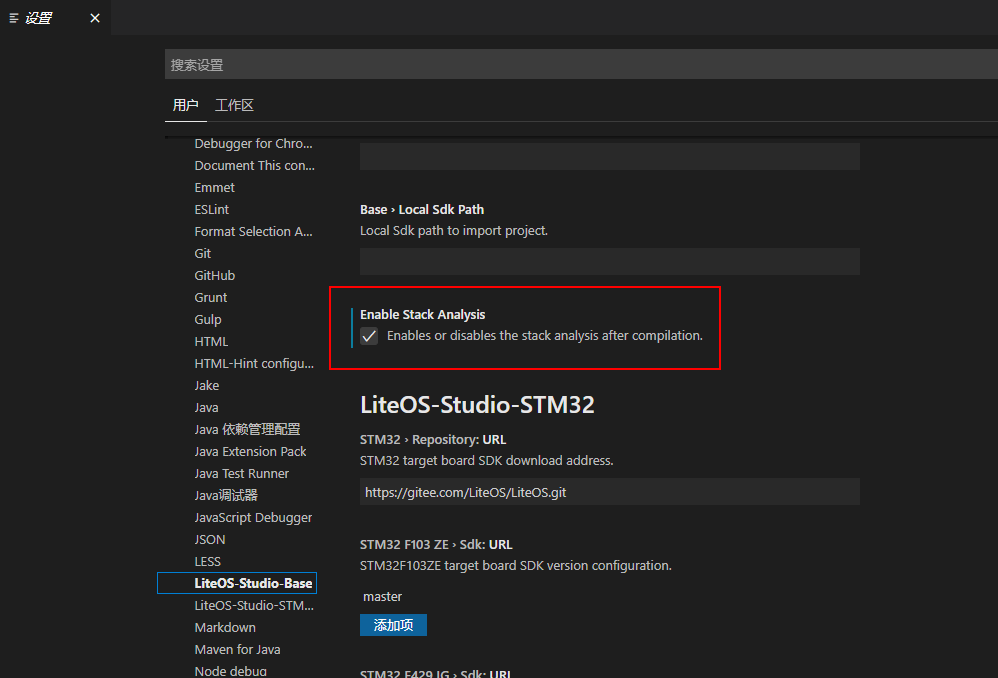
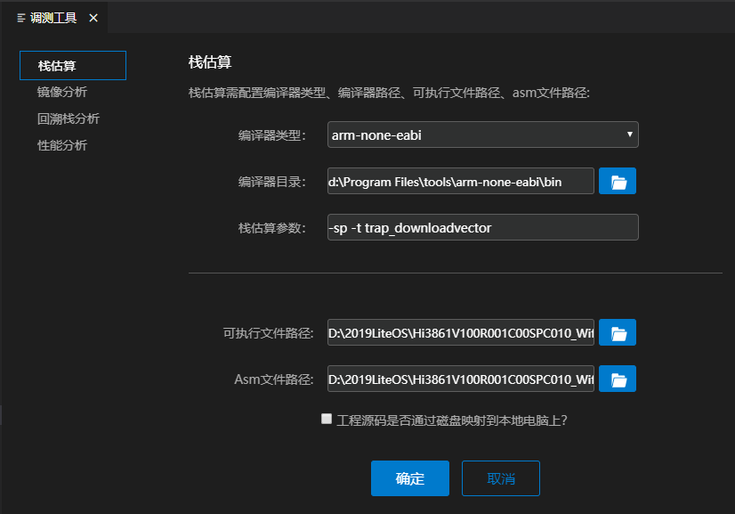
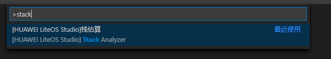
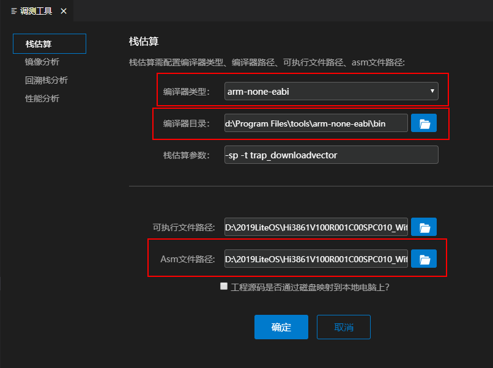
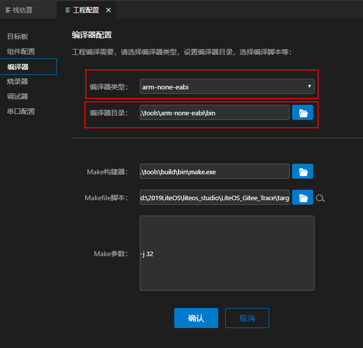
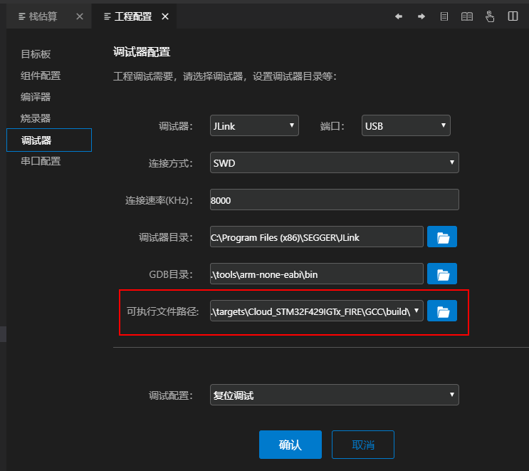
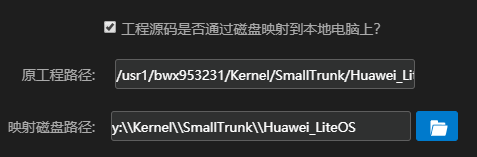
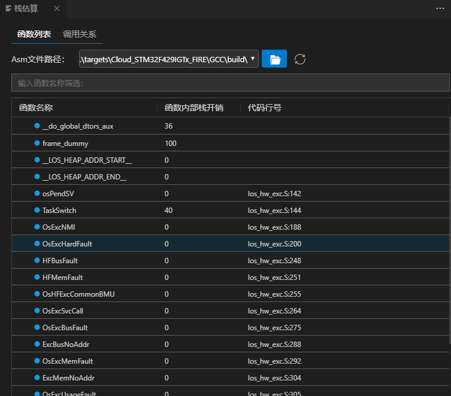
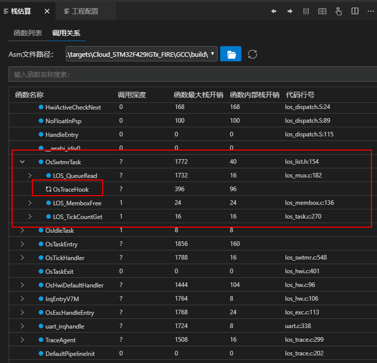

  <h1 align="center">栈估算工具</h1>

栈估算工具是基于静态二进制分析手段，提供任务栈开销估算值和函数调用关系图示，为栈内存使用、分析、优化、问题定位等开发场景提供较为准确的静态内存分析数据参考。

### 1、使能栈估算功能
打开Liteos Studio工具，在设置界面打开栈估算开关，开启后当工程执行编译时会自动进行栈估算。

### 2、栈估算入口
> 打开Liteos Studio工具，点击调测工具里的栈估算tab页签，设置编译器、可执行文件路径等，然后点击确定进入栈估算页面。

> 或者通过打开命令行输入`Stack`找到`Stack Analyzer`点击进入。

### 3、栈估算相关配置
栈估算依赖工程的asm文件，需要配置asm文件路径。

如果需要解析函数对应的代码行号，则需要准确配置编译器类型、编译器路径、可执行文件路径（如elf文件、bin文件）。可以在上面调测工具设置界面进行配置，也可以如下图所示在工程配置界面进行配置。

栈估算还支持参数输入，目前仅支持如-sp -t taskentry1 taskentry2，即指定只解析taskentry1和taskentry2这两个任务入口函数。

如果工程源码在linux上，可将工程映射到windows磁盘上，然后进行相关路径配置如下图所示。

### 4、结果展示
栈估算结果按函数列表和调用关系展示，如下图所示。

函数列表界面显示每个函数的函数名称、函数内部栈开销、代码行号。支持函数名称过滤功能。

调用关系界面显示每个函数的调用关系、函数名称、调用深度、函数最大栈开销、函数内部栈开销、代码行号。如果函数调用中存在回环，则会用回环图标标记，对应调用关系用“？”表示。同时，界面支持函数名称搜索和代码行号跳转。

