

  <h1 align="center">Trace工具</h1>

可视化Trace工具支持对LiteOS系统关键数据进行实时跟踪，保存与回放。Trace Server实现轻量级LiteOS事件监测，Trace Client可以让用户在任意时刻开始和停止记录Trace，并且可以图形化展示事件、CPU、内存、运行轨迹等信息。

### Trace Server使用说明

#### 使能Trace功能

make menuconfig 进入模块配置界面，如下，开启扩展内核下的trace模块

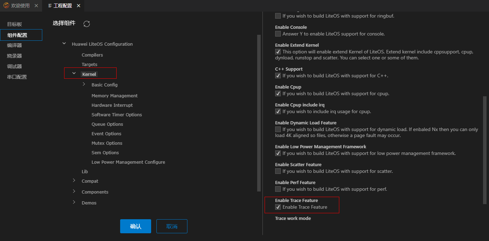

选择trace工作模式

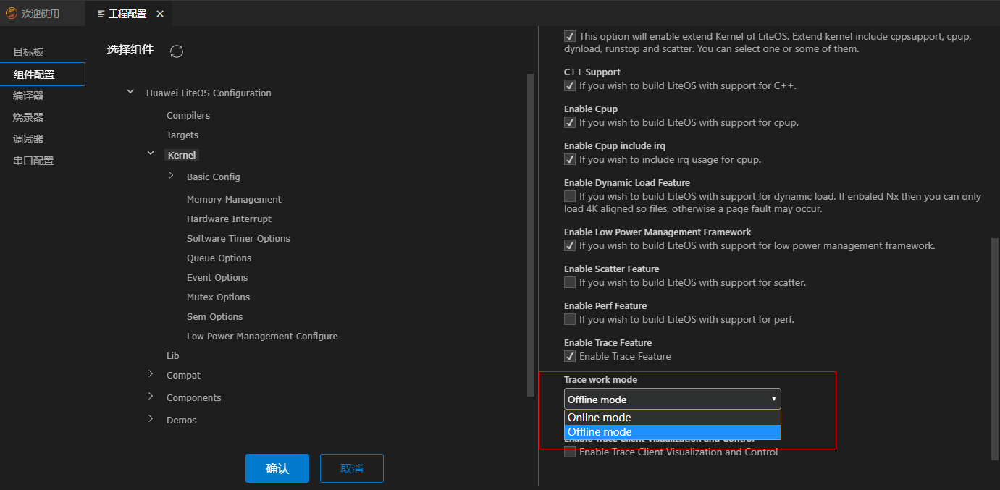

1.online实时输出模式，在该模式下，trace默认为停止状态，用户需主动调用trace start来启动trace功能，且触发的trace事件会立即从传输口输出（如串口）， 通过调用trace stop来停止trace功能；

2.offline离线缓存模式，在该模式下，trace默认为启动状态，且触发的trace事件会缓存在buffer中，用户可进行线下工具导出（Jlink JMem）或者调用trace dump接口从传输口输出， 通过调用trace stop来停止trace功能、通过调用trace reset来清除buffer中的记录；

3.系统默认trace为offline模式

选择trace数据输出方式

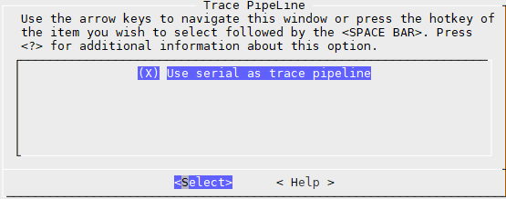

Trace数据输出方式目前仅支持串口输出，后续可扩展为TCPIP输出、蓝牙输出、JLINK输出等多种方式

#### Trace流程控制

三种方式：

1.	用户可自行在代码中插入trace 对外API：LOS_TraceStart\LOS_TraceStop（los_trace.h）

2.	在具备shell模块的开发环境中，开启shell, 则可通过shell命令控制trace流程，目前已支持的shell trace命令包括：trace_start 、trace_stop、trace_mask、trace_reset、trace_dump

3.	在无shell模块的开发环境中，注册uart中断回调，也可实现trace流程控制，如下：

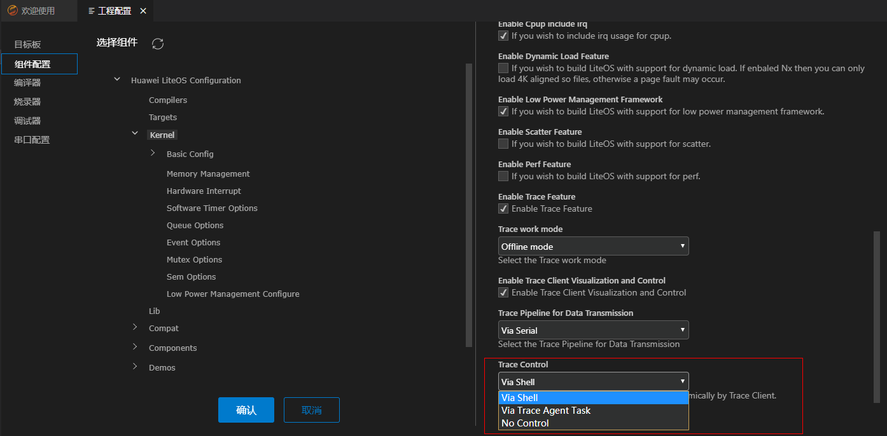

上述2、3种方式也交由Trace Client调用，用户可直接在Client端控制trace启动、停止流程。

#### Trace流程控制之驱动适配
TraceAgent用于响应trace 客户端的请求, 包括：启动、停止、设置事件掩码、dump离线trace的缓存数据等功能。

下面以uart适配为例，介绍如何实现响应客户端请求：

1. 实现SerialPiplineInit(void)，必要的资源创建等，如创建uart接受中断；

2. 实现SerialPiplineReceive(unsigned char *data, unsigned int len, unsigned int timeout), 提供读取uart接受到的数据到data中的功能；

3. 实现SerialDataSend(unsigned short len, unsigned char *data)，提供uart发送data数据的功能；

4. 实现SerialWait(void)，提供等待信号，等到后再去读取uart数据的功能；

5. 实现OsTracePipelineInit接口，将上述串口功能通过OsTracePipelineReg注册到系统中， 并初始化之，如下图所示：

注意：客户端会发送以0xD 0xA 结束的数据串，如 “01 00 00 00 00 00 0d 0a”， SerialPiplineReceive需要将0xA之前的数据赋值给data, 如“01 00 00 00 00 00 0d”

当trace发送数据流较频繁时，可能存在丢失数据的情况，可能存在Client控制命令丢失的情况。

建议：1. 减少发送数据流； 2.使用更高传输速率的其他通道。

#### Trace代码桩

##### 简易插桩
提供给用户极简的一句话插桩：

LOS_TRACE_EASY(Type, Identity, params...);

Type 有效取值范围为[0, 0xF], 表示不同的事件类型；

Identity 类型UINTPTR，表示事件描述的主要对象；

Params 类型UINTPTR， 表示该事件的参数；

示例：
LOS_TRACE_EASY(1, userId0, userParam1, userParam2);

LOS_TRACE_EASY(2, userId0);

LOS_TRACE_EASY(1, userId1, userParam1, userParam2);

LOS_TRACE_EASY(2, userId1);

##### 标准插桩
trace事件类型定义如下：

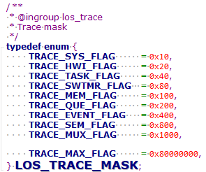

1.TRACE_MASK为事件掩码，粒度为模块级别，如果用户自定义trace模块，则需保证FLAG中取值为1的bit位与其他模块不同，且不超过上限；

扩展语法为：TRACE_#MOD#_FLAG；

2.TRACE_TYPE 为具体的事件类型，粒度为接口级别；

扩展语法为：#TYPE# = TRACE_#MOD#_FLAG | N；

用户可按上述扩展语法进行新增事件定义

3.参数宏定义：

扩展语法为：#TYPE#_PARAMS(Identity, parma1...)	Identity, ... 

使能某事件，通过define对应事件宏至少1个参数，来追踪该类型事件

去能某事件，通过define对应事件宏0参数，如上图335行, 则不追踪该类型事件

用户可按照宏定义来裁剪不必要的参数, 如上图337行

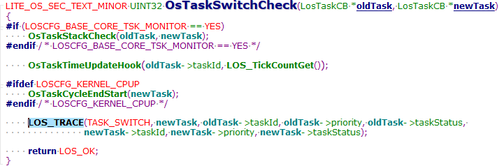

4.代码桩插入：

如上图所示, 在代码适当位置，插入桩，扩展语法如下：

	LOS_TRACE(#TYPE#, Identity, params...)

目前系统默认仅插入了基础内核的代码桩，用户可按需新增插入。

5.（可选）为实现trace事件可在前端用自然语言表达，针对用户扩展的事件需配置前端的事件表达，详见Trace Client使用说明。

6.示例：新增文件系统trace事件如下：

	step 1.定义模块掩码：

	TRACE_FS_FLAG = 0x2000

	step 2.定义具体事件类型： 

	FS_READ  = TRACE_FS_FLAG | 0; // 文件读

	FS_WRITE = TRACE_FS_FLAG | 1; // 文件写

	step 3.定义事件参数：

	FS_READ_PARAMS(fp, fd, flag, size)	fp, fd, flags, size

	step 4.在适当位置插入代码桩：

	LOS_TRACE(FS_READ, fp, fd, flag, size);

#### Trace事件过滤

支持事件动态过滤：

1.调用LOS_TraceEventMaskSet(UINT32 mask) 传入相应模块的使能位TRACE_#MOD#MASK来使能

2.通过客户端来设置使能位，详见客户端指导

系统默认的trace mask为使能任务和中断。

注意：简易插桩事件仅当mask设置为0时去能，其他情况均为使能；用户如需要动态分模块过滤事件，建议使用标准插桩定义新增事件。

#### Trace数据裁剪

1.Core信息可裁剪，其包含系统状态信息：cpuid、hwiActive、isTaskLock等信息

2.trace事件计数可裁剪，其表示事件发生的序列

3.trace事件的参数可裁剪，对应#MOD#OPS#PARAMS 对应的参数

4.trace记录task obj任务信息可裁剪，其包含任务名，任务优先级信息

用户可按需进行配置。

### Trace Client使用说明

	当前Trace工具支持STM32F429IG工程、hi3556v200工程，使用Trace Client前开发板需已烧录支持trace功能的版本，trace支持在线和离线模式，可在工程中配置（参考`Trace Server使用说明`）。

#### Trace入口

	首先安装Trace插件，然后侧边栏点击trace按钮进入trace页面。

#### Trace设置

	抓取trace数据前需设置开发板的串口信息，如下图所示。

	用户还可以自定义trace事件，设置需要过滤的事件类型。

	如下图所示，勾选需要记录的事件类型。

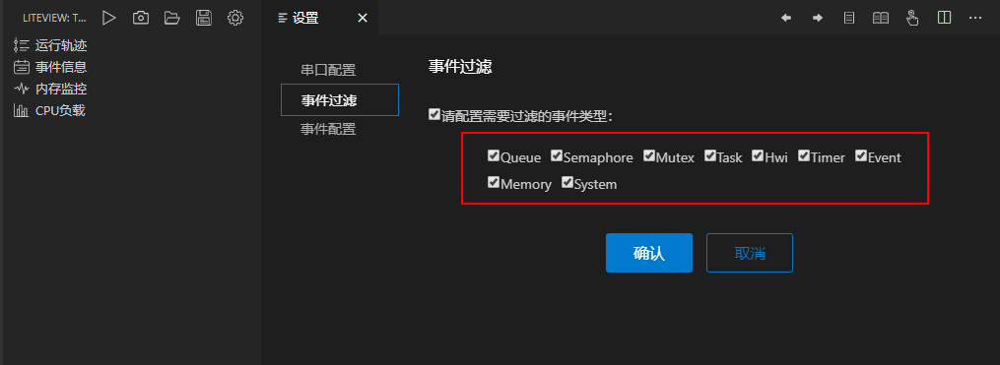

	如下图所示，用户可以自定义trace事件，需填写事件类型、事件编号、事件描述、事件参数。

#### Trace操作

	Trace工具支持开始Trace、停止Trace、导出Trace、保存Trace、打开Trace。

	Trace在线模式时，点击开始按钮记录trace事件，界面可实时展示trace信息，点击停止按钮停止记录trace事件。trace离线模式时，可点击导出trace按钮，导出完成后trace数据展示在界面上。

	trace数据还支持保存和查看历史数据：点击保存按钮，当前页面数据将以.db文件格式保存在指定位置上；点击打开按钮，可查看历史的trace数据，目前支持db文件格式和txt文件格式，db文件
	保存的是已解析完成的trace数据，txt文件保存的是从串口直接打印的二进制原始数据。

#### Trace视图

	trace数据展示，当前支持事件信息、任务运行轨迹、CPU负载、内存使用情况。

#### Trace事件视图

	事件信息通过表格方式展示，支持根据事件类型过滤，也支持根据关键字过滤，将鼠标移动到任务列可查看任务详情。用户还可以将数据导出保存成excel格式，进一步进行数据分析。

#### Trace运行轨迹

	运行轨迹视图展示每个任务在各个时间段的运行状态，可直观查看任务运行时长和切换过程。

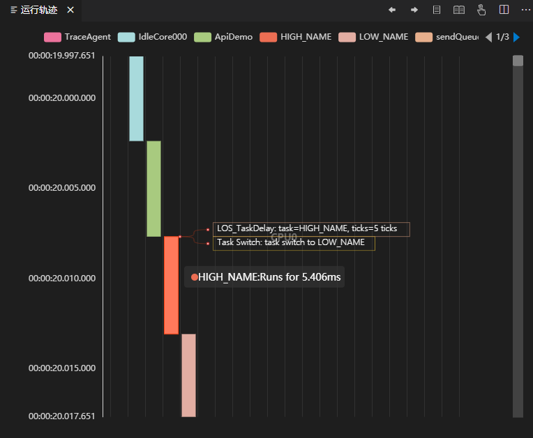

#### Trace CPU视图

	CPU视图支持柱状图和饼图两种方式展示，柱状图可查看每个时刻每个任务的CPU使用情况；饼图可查看一定时间内每个任务的CPU使用情况。用户还可以通过点击图例中某个任务打开或关闭CPU占用率显示。
	
	说明：CPU数据是定时采样，如果trace抓取时间小于0.1s则获取不到cpu数据。

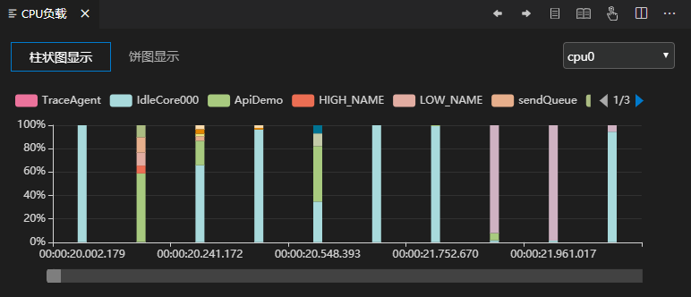

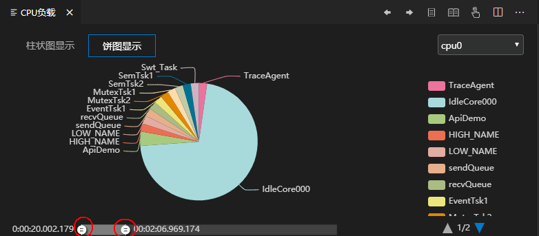

#### Trace 内存视图

	内存视图通过折线图展示系统内存的变化趋势，记录每个时刻的内存总量、已用内存和剩余内存。

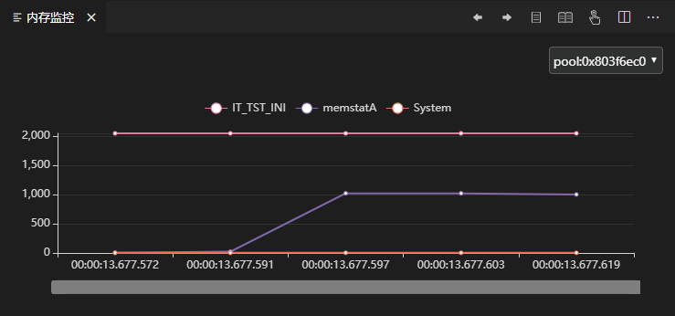